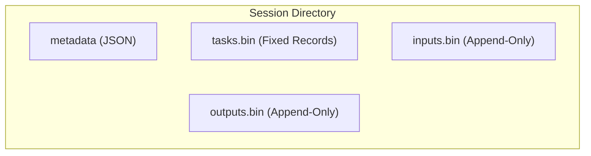

# Design Document: Filesystem-Based Storage Engine (Single-File Architecture)

## 1. Motivation

**Background:**

The current `flame-session-manager` uses SQLite (and optionally PostgreSQL) as the storage backend. While robust, database overhead (WAL, locking, serialization) limits throughput for high-frequency task workloads. The previous directory-per-task design was rejected due to excessive inode usage and filesystem metadata overhead.

**Target:**

Implement a high-performance `filesystem` storage engine that:
1.  Uses a **single-file architecture** per session for tasks to minimize filesystem metadata operations.
2.  Uses **fixed-size records** for task metadata to allow O(1) random access.
3.  Uses **append-only** files for variable-length data (inputs/outputs) to maximize write throughput.
4.  Relies on **in-memory locks** (provided by the Session Manager) rather than file locks.

**Success Criteria:**
- Task creation throughput significantly higher than SQLite.
- Minimal inode usage (constant files per session, regardless of task count).
- Zero data loss under normal operation.

## 2. Function Specification

**Configuration:**

```yaml
cluster:
  # Absolute path (triple slash)
  storage: "fs:///var/lib/flame"

  # Relative to FLAME_HOME (double slash, recommended)
  storage: "fs://data"  # Resolves to ${FLAME_HOME}/data
```

**URL Schemes:**

All three schemes (`filesystem://`, `file://`, `fs://`) follow the same path resolution:
- Triple slash (e.g., `fs:///data`) → Absolute path (`/data`)
- Double slash (e.g., `fs://data`) → Relative to `${FLAME_HOME}` (defaults to `/usr/local/flame`)

**Scope:**

- **In Scope:**
  - `tasks.bin`: Fixed-size metadata storage.
  - `inputs.bin`: Append-only input storage.
  - `outputs.bin`: Append-only output storage.
  - Session and Application metadata (JSON).
  - Recovery on startup.

- **Out of Scope:**
  - **Events & Messages**: These are NOT stored by the storage engine. They are handled by the internal `EventManager` (`crate::events` in `flame-session-manager`).
  - Distributed access: Single-node only.

- **Limitations:**
  - Single-process only; no cross-process file locking.
  - Append-only data files cannot reclaim space from deleted tasks.
  - Maximum file sizes limited by underlying filesystem (typically 16TB+).

- **Concurrency:**
  - The filesystem engine uses a `RwLock<HashMap<SessionID, Mutex>>` for concurrency control.
  - `lock_ssn!(ssn_id)`: Acquires read lock on the map, then locks the session mutex. Used for all task operations (`create_task`, `get_task`, `find_tasks`, `retry_task`, `update_task_state`, `update_task_result`).
  - `lock_app!()`: Acquires write lock on the map, blocking all session operations. Used for cross-session operations (`create_session`, `delete_session`, `unregister_application`, `update_application`).
  - Session locks are created in `create_session` and removed in `delete_session`.

**Feature Interaction:**

- **Related Features:**
  - `EventManager` (`crate::events`): Handles task events and messages separately from storage.
  - Existing `sqlite` and `postgres` storage engines: Alternative backends with different trade-offs.

- **Updates Required:**
  - `storage::Engine` trait: No changes required; this implementation conforms to existing trait.
  - Configuration parser: Must recognize `filesystem://`, `file://`, and `fs://` URI schemes.

- **Integration Points:**
  - Storage engine is instantiated by Session Manager based on configuration.
  - Task reconstruction aggregates data from storage engine + EventManager.
  - Recovery process is invoked on Session Manager startup.

- **Compatibility:**
  - **Backward Compatible**: Existing SQLite/PostgreSQL configurations continue to work unchanged.
  - **Migration Path**: No automatic migration from SQLite to filesystem. Users must start fresh or manually export/import.

- **Breaking Changes:** None. This is a new, opt-in storage backend.

## 3. Implementation Detail

### Architecture

Instead of creating a directory for every task, we use three files per session to store all task data.



### Directory Structure

```
<work_dir>/
└── data/
    ├── sessions/
    │   └── <session_id>/
    │       ├── metadata          # Session metadata (JSON)
    │       ├── tasks.bin         # TaskMetadata records (Index = Task ID)
    │       ├── inputs.bin        # Concatenated input data
    │       └── outputs.bin       # Concatenated output data
    └── applications/
        └── <app_name>/
            └── metadata          # Application metadata (JSON)
```

### Data Structures

**Task Metadata (Fixed-Size Binary):**

We use `serde` + `bincode` for serialization. We rely on `bincode`'s predictable sizing for fixed-width types to ensure O(1) random access. The struct uses `u64` for IDs and offsets to support large datasets.

```rust
use serde::{Serialize, Deserialize};

#[derive(Serialize, Deserialize, Debug, Clone)]
pub struct TaskMetadata {
    pub id: u64,                    // 8 bytes - Task ID (Index in file)
    pub version: u32,               // 4 bytes - Optimistic locking
    pub checksum: u32,              // 4 bytes - CRC32 of the record (calculated via crc32fast)
    pub state: u8,                  // 1 byte - TaskState enum
    pub creation_time: i64,         // 8 bytes - Unix timestamp
    pub completion_time: i64,       // 8 bytes - Unix timestamp
    
    // Input Location (in inputs.bin)
    pub input_offset: u64,          // 8 bytes
    pub input_len: u64,             // 8 bytes
    
    // Output Location (in outputs.bin)
    pub output_offset: u64,         // 8 bytes
    pub output_len: u64,            // 8 bytes
}
// Total size: Sum of fields (approx 61 bytes, depending on bincode overhead/padding)
// Note: We verify the serialized size at runtime to ensure it is constant.
```

**Serialization Strategy:**
- **Library:** `bincode` with `fixint` encoding to ensure fixed-size integers.
- **Checksum:** `crc32fast` crate used to calculate CRC32 checksums for data integrity.
- **Alignment:** `bincode` handles endianness and alignment automatically. We do not manually pad the struct, but we assert that `bincode::serialized_size` is constant for any instance.

**Session Metadata (JSON):**
Standard JSON format (unchanged).


### Algorithms

**1. Task Creation (Append):**
*   **Context**: Caller holds session lock.
*   **Step 1**: Determine new Task ID (current file size of `tasks.bin` / RECORD_SIZE).
*   **Step 2**: Append input data to `inputs.bin`. Record `input_offset` (file end before write) and `input_len`.
*   **Step 3**: Construct `TaskMetadata` with the new ID, input location.
*   **Step 4**: Calculate `checksum` using `crc32fast::Hasher`.
*   **Step 5**: Serialize `TaskMetadata` using `bincode::serialize`.
*   **Step 6**: Append serialized bytes to `tasks.bin`.
*   **Step 7**: Flush/Sync (optional based on durability config).

**2. Task Update (Random Write):**
*   **Context**: Caller holds session lock.
*   **Step 1**: Calculate offset in `tasks.bin`: `offset = task_id * RECORD_SIZE`.
*   **Step 2**: If updating output:
    *   Append data to `outputs.bin`.
    *   Update `output_offset` and `output_len` in metadata struct.
*   **Step 3**: Update other fields (state, completion_time).
*   **Step 4**: Recalculate `checksum`.
*   **Step 5**: Serialize updated `TaskMetadata`.
*   **Step 6**: Write serialized bytes to `tasks.bin` at calculated offset (using `pwrite` or `seek+write`).


**3. Task Retrieval (Random Read):**
*   **Step 1**: Read `RECORD_SIZE` bytes from `tasks.bin` at `offset = task_id * RECORD_SIZE`.
*   **Step 2**: Deserialize using `bincode::deserialize`.
*   **Step 3**: Validate `checksum`. If mismatch, return `Corrupted` error.
*   **Step 4**: If input needed, read from `inputs.bin` using `input_offset` and `input_len`.
*   **Step 5**: If output needed, read from `outputs.bin` using `output_offset` and `output_len`.

**4. Task Reconstruction (Aggregator Logic):**
To reconstruct a full `Task` object compatible with `common/src/apis.rs`, we aggregate data from the storage engine (Source of Truth) and the `EventManager` (Supplementary).

```rust
fn reconstruct_task(session_id, task_id, storage_engine, event_manager) -> Result<Task, Error> {
    // 1. Fetch Primary Data from Filesystem Storage (Source of Truth)
    // This MUST succeed. If this fails, the task does not exist or is corrupted.
    let metadata = storage_engine.read_metadata(session_id, task_id)?;
    let input_data = storage_engine.read_input(session_id, task_id).optional();
    let output_data = storage_engine.read_output(session_id, task_id).optional();

    // 2. Initialize Task Object
    let mut task = Task {
        id: metadata.id,
        ssn_id: metadata.ssn_id,
        version: metadata.version,
        state: metadata.state,
        creation_time: metadata.creation_time,
        completion_time: metadata.completion_time,
        input: input_data,
        output: output_data,
        events: Vec::new(),  // Placeholder
    };

    // 3. Fetch Supplementary Data from EventManager (Best Effort)
    match event_manager.get_events(session_id, task_id) {
        Ok(events) => task.events = events,
        Err(e) => {
            // Graceful degradation: Log warning but return Task with empty events
            log::warn!("Failed to fetch events for task {}: {}", task_id, e);
            task.events = Vec::new(); 
        }
    }

    Ok(task)
}
```

**5. Recovery:**
*   Scan `sessions/` directory.
*   Read `tasks.bin` sequentially to rebuild in-memory state.
*   **Partial Write Recovery**: If `tasks.bin` size is not a multiple of `RECORD_SIZE`, truncate to the nearest multiple (discard partial record).
*   **Cross-File Consistency**: For each task, verify `input_offset + input_len <= inputs.bin.size`. If invalid, mark task as `Corrupted` or discard.
*   **Checksum Validation**: Verify `checksum` for each record. If invalid, mark task as `Corrupted`.

### Concurrency & Locking

*   **Single-Process Only**: This engine is designed for **single-process** usage. It does **not** support multiple processes accessing the same session directory concurrently. No cross-process file locking (e.g., `flock`) is implemented.
*   **Memory Locks**: The `flame-session-manager` guarantees that operations on a specific session are serialized via in-memory locks (e.g., `RwLock<Session>`).
*   **Atomic Appends**: For `inputs.bin` and `outputs.bin`, we rely on append-only behavior.
*   **Metadata Integrity**: `tasks.bin` updates are fixed-size writes.


### System Considerations

**Performance:**
- **Latency**: O(1) task lookup via fixed-size records and direct offset calculation.
- **Throughput**: Sequential I/O for task creation (append-only) maximizes disk bandwidth.
- **Optimization**: Batch writes can be buffered in memory before flushing to reduce syscall overhead.
- **Benchmarks**: Target >10x throughput improvement over SQLite for task creation workloads.

**Scalability:**
- **Horizontal**: Not supported; single-node only by design.
- **Vertical**: Scales with disk I/O capacity and memory for file handles.
- **Capacity Limits**: 
  - Tasks per session: Limited by `u64` ID space (~18 quintillion) and filesystem size limits.
  - Sessions: Limited by filesystem inode count (4 files per session).
  - Data size: `u64` offsets support exabyte-scale files; practical limit is filesystem (typically 16TB+).

**Reliability:**
- **Availability**: Single-node; availability equals host uptime.
- **Fault Tolerance**: 
  - CRC32 checksums detect corruption on read.
  - Partial write recovery truncates incomplete records on startup.
  - Cross-file consistency validation marks orphaned data as corrupted.
- **Error Recovery**: Corrupted tasks are marked and skipped; healthy tasks remain accessible.
- **Failure Modes**:
  - Disk full: Write operations fail with I/O error; existing data preserved.
  - Power loss: Partial writes detected and truncated on recovery.
  - Bit rot: Detected via checksum validation.

**Resource Usage:**
- **Memory**: Minimal; only file handles and small buffers. No in-memory caching of task data.
- **CPU**: Low; serialization/deserialization is fast with `bincode`. CRC32 calculation is hardware-accelerated on modern CPUs.
- **Disk**: 
  - Fixed overhead: ~61 bytes per task in `tasks.bin`.
  - Variable: Input/output sizes depend on workload.
  - No WAL or journal overhead (unlike SQLite).
- **Network**: None; local filesystem only.

**Security:**
- **Authentication/Authorization**: Delegated to Session Manager; storage engine trusts caller.
- **Data Protection**: 
  - Files inherit filesystem permissions (recommend `0600` for session directories).
  - No encryption at rest (out of scope; use filesystem-level encryption if needed).
- **Threat Model**:
  - Assumes trusted local environment.
  - No protection against malicious local users with filesystem access.

**Observability:**
- **Logging**: 
  - INFO: Session creation/deletion, recovery completion.
  - WARN: Checksum mismatches, partial write recovery, cross-file inconsistencies.
  - ERROR: I/O failures, unrecoverable corruption.
- **Metrics** (recommended for future implementation):
  - `fs_storage_tasks_created_total`: Counter of tasks created.
  - `fs_storage_tasks_corrupted_total`: Counter of corrupted tasks detected.
  - `fs_storage_recovery_duration_seconds`: Histogram of recovery time.
  - `fs_storage_file_size_bytes`: Gauge of file sizes per session.
- **Tracing**: Not implemented; add span IDs to logs if distributed tracing is needed.

**Operational:**
- **Deployment**: No special requirements; works on any POSIX-compliant filesystem.
- **Maintenance**: 
  - Periodic backup of `<work_dir>/data/` recommended.
  - No compaction needed for `tasks.bin`; append-only files grow indefinitely.
- **Disaster Recovery**: 
  - Restore from backup to recover sessions.
  - No point-in-time recovery (unlike database WAL).

### Dependencies

**External Dependencies:**

| Crate | Version | Purpose |
|-------|---------|---------|
| `serde` | ^1.0 | Serialization framework |
| `bincode` | ^1.3 | Binary serialization with fixed-size encoding |
| `crc32fast` | ^1.3 | Hardware-accelerated CRC32 checksums |

**Internal Dependencies:**

| Component | Purpose |
|-----------|---------|
| `flame-session-manager` | Provides session-level locking and invokes storage engine |
| `EventManager` (`crate::events`) | Handles task events separately from storage |
| `storage::Engine` trait | Interface this implementation conforms to |
| `common::apis::Task` | Task struct definition for reconstruction |

**Version Requirements:**
- Rust: 1.70+ (for stable async traits if needed)
- Filesystem: POSIX-compliant (Linux ext4, XFS recommended; macOS APFS supported)


## 4. Use Cases

**UC1: High-Throughput Submission**
*   Client submits 1000 tasks.
*   Engine appends 1000 inputs to `inputs.bin`.
*   Engine appends 1000 records to `tasks.bin`.
*   **Benefit**: Sequential I/O, no directory creation overhead.

**UC2: Task Completion**
*   Executor finishes Task #50.
*   Engine appends result to `outputs.bin`.
*   Engine updates record #50 in `tasks.bin` (seek to `50 * RECORD_SIZE`, write record).
*   **Benefit**: Minimal seek overhead, data locality.

**UC3: Restart/Crash**
*   System restarts.
*   Engine reads `tasks.bin` sequentially.
*   Reconstructs state for all tasks instantly without traversing thousands of directories.
*   Validates integrity via checksums and file length checks.

## 5. Engine Trait Implementation

This section details how the `storage::Engine` trait methods map to the filesystem architecture.

### `create_session(&self, session: Session) -> Result<(), Error>`
1.  **Path Resolution**: Resolve path `data/sessions/<session.id>`.
2.  **Directory Creation**: Create directory using `fs::create_dir_all`.
3.  **Metadata Write**: Serialize `session` struct to JSON.
4.  **Atomic Write**: Write JSON to `metadata.tmp`, then rename to `metadata`.
5.  **File Initialization**: Create empty `tasks.bin`, `inputs.bin`, `outputs.bin` if they don't exist.

### `create_task(&self, task: Task) -> Result<(), Error>`
1.  **Locking**: Assumes caller holds session lock.
2.  **Input Handling**:
    *   Open `inputs.bin` in append mode.
    *   Get current file size as `input_offset`.
    *   Write `task.input` bytes.
    *   Calculate `input_len`.
3.  **Metadata Construction**:
    *   Calculate `task_id` = `tasks.bin` size / `RECORD_SIZE`.
    *   Create `TaskMetadata` struct with `id`, `state`, `input_offset`, `input_len`.
    *   Calculate CRC32 checksum.
4.  **Metadata Write**:
    *   Serialize `TaskMetadata`.
    *   Append to `tasks.bin`.
5.  **Sync**: Call `fs::sync_data` on both files if durability is required.

### `update_task(&self, task: Task) -> Result<(), Error>`
1.  **Validation**: Check if `task.id` exists (file size check).
2.  **Output Handling** (if `task.output` is present):
    *   Open `outputs.bin` in append mode.
    *   Get current file size as `output_offset`.
    *   Write `task.output` bytes.
    *   Update `output_offset` and `output_len` in metadata.
3.  **Metadata Update**:
    *   Read existing metadata at `offset = task.id * RECORD_SIZE`.
    *   Update fields: `state`, `completion_time`, `version`.
    *   Recalculate checksum.
    *   Serialize to `RECORD_SIZE` bytes.
4.  **Write Back**:
    *   Open `tasks.bin` in write mode (not append).
    *   Seek to `offset`.
    *   Write bytes.

### `find_task(&self, session_id: SessionID, task_id: TaskID) -> Result<Option<Task>, Error>`
1.  **Path Resolution**: Open `data/sessions/<session_id>/tasks.bin`.
2.  **Seek & Read**:
    *   Calculate `offset = task_id * RECORD_SIZE`.
    *   Seek to `offset`.
    *   Read `RECORD_SIZE` bytes.
3.  **Deserialization**:
    *   Deserialize to `TaskMetadata`.
    *   Verify checksum.
4.  **Data Fetch**:
    *   Read input from `inputs.bin` using `input_offset/len`.
    *   Read output from `outputs.bin` using `output_offset/len`.
5.  **Reconstruction**:
    *   Call `reconstruct_task` (see Algorithms section) to combine with events.

### `delete_session(&self, session_id: SessionID) -> Result<(), Error>`
1.  **Path Resolution**: Resolve path `data/sessions/<session_id>`.
2.  **Recursive Delete**: Call `fs::remove_dir_all`.

### `list_sessions(&self) -> Result<Vec<Session>, Error>`
1.  **Directory Scan**: Read `data/sessions/` directory.
2.  **Metadata Read**: For each subdirectory, read `metadata` JSON file.
3.  **Deserialization**: Parse JSON to `Session` struct.
4.  **Aggregation**: Return vector of sessions.

## 6. Risks & Mitigations

| Risk | Mitigation |
|------|------------|
| **File Corruption** | Added `checksum` (CRC32) to `TaskMetadata` to detect bit rot or partial writes. |
| **Partial Writes** | On startup, check if `tasks.bin` size is multiple of `RECORD_SIZE`. Truncate excess bytes. |
| **Cross-File Inconsistency** | Validate offsets against file sizes on startup. Mark invalid tasks as corrupted. |
| **Large Files** | `u64` offsets support exabytes. Filesystem limits apply (usually 16TB+). |
| **Concurrency Bugs** | Strictly enforce "Session Manager must lock session before calling Engine". Single-process only. |
| **Alignment Issues** | Mitigated by using `serde` + `bincode` instead of `packed` structs. |

## 7. References

**Related Documents:**
- Issue #21: Original feature request for filesystem storage
- `flame-session-manager` architecture documentation
- `storage::Engine` trait definition in `session-manager/src/storage/mod.rs`

**External References:**
- [bincode documentation](https://docs.rs/bincode/latest/bincode/)
- [crc32fast documentation](https://docs.rs/crc32fast/latest/crc32fast/)
- [serde documentation](https://serde.rs/)

**Implementation References:**
- `session-manager/src/storage/filesystem.rs` (to be created)
- `session-manager/src/storage/mod.rs` (Engine trait)
- `common/src/apis.rs` (Task struct definition)
