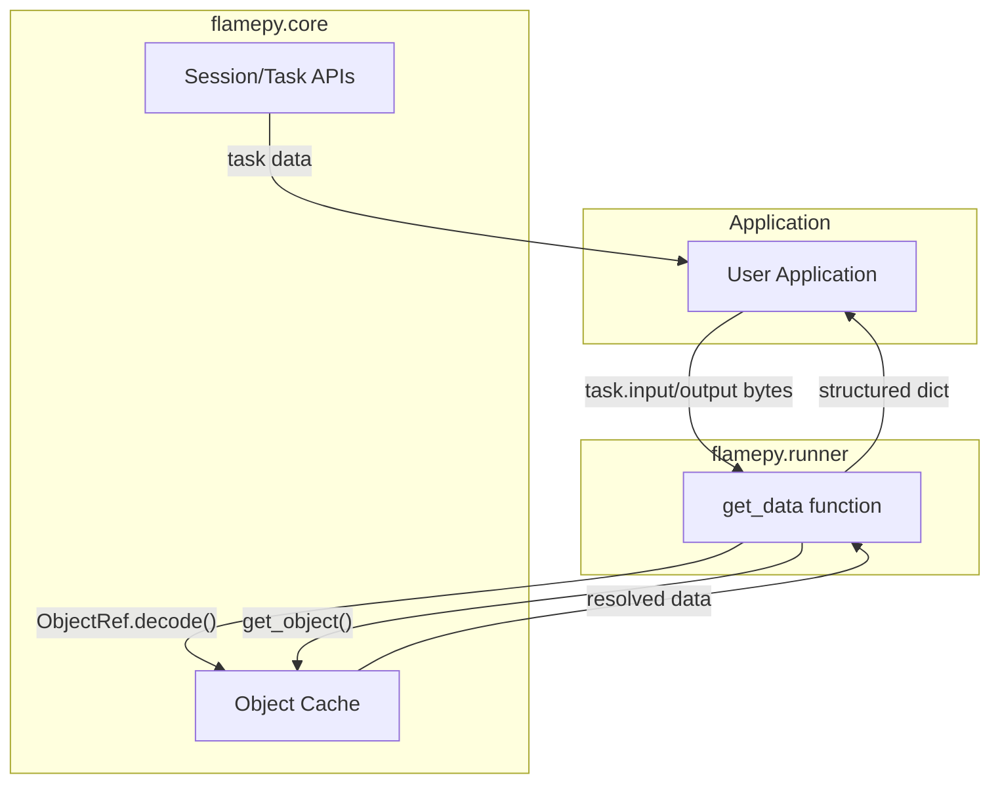

# RFE364: Retrieve Input/Output of Runner Task in flamepy

## 1. Motivation

**Background:**

The `flamepy.Runner` uses Flame Session/Task to execute workloads. When a task is submitted via `RunnerService`, the input and output are stored as `ObjectRef` pickled data in the Flame cache. Currently, there is no convenient way for applications to inspect the actual input/output data of a task after it has been executed.

The current data flow is:
1. **Input**: `RunnerRequest` (containing method name, args, kwargs) is serialized with cloudpickle and stored in the cache. The task input is the `ObjectRef` pointing to this data.
2. **Output**: The task result is stored in the cache, and the task output is an `ObjectRef` pointing to this result.

Both `RunnerRequest.args` and `RunnerRequest.kwargs` may contain `ObjectRef` instances that need to be resolved to get the actual data.

**Target:**

Provide a `get_data` helper function in `flamepy.runner` that:
1. Takes raw task input or output bytes (which are `ObjectRef` encoded data)
2. Unpickles and resolves the data to its actual values
3. Returns a structured dictionary with the resolved data
4. Handles both `RunnerRequest` (input) and raw result objects (output)

## 2. Function Specification

### Configuration

No configuration changes required. The function uses existing cache configuration from `FlameContext`.

### API

**New Function: `get_data`**

```python
def get_data(data: bytes) -> Dict[str, Any]:
    """Retrieve the real data from task input or output.
    
    This function takes the raw bytes from a Flame task's input or output,
    decodes the ObjectRef, retrieves the data from cache, and resolves
    any nested ObjectRef instances to their actual values.
    
    Args:
        data: Raw bytes from task input or output. This is expected to be
              an encoded ObjectRef pointing to either:
              - A RunnerRequest (for task input)
              - A result object (for task output)
    
    Returns:
        A dictionary containing the resolved data:
        
        For task input (RunnerRequest):
        {
            "type": "input",
            "method": str | None,  # Method name or None for callable
            "args": tuple | None,  # Resolved positional arguments
            "kwargs": dict | None,  # Resolved keyword arguments
            "metadata": dict       # Additional metadata
        }
        
        For task output (result):
        {
            "type": "output",
            "result": Any,  # The actual result value
            "metadata": dict  # Additional metadata
        }
    
    Raises:
        RunnerError: With error_type indicating the specific error:
            - ErrorType.DECODE_ERROR: If the data cannot be decoded
            - ErrorType.CACHE_RETRIEVAL_ERROR: If the object cannot be retrieved from cache
            - ErrorType.DATA_FORMAT_ERROR: If the data format is not recognized
    
    Example:
        >>> from flamepy.runner import get_data, RunnerError, ErrorType
        >>> from flamepy.core import get_session
        >>> 
        >>> # Get a session and its tasks
        >>> session = get_session("my-session-id")
        >>> for task in session.tasks:
        ...     try:
        ...         if task.input:
        ...             input_data = get_data(task.input)
        ...             print(f"Task {task.id} input: {input_data}")
        ...         if task.output:
        ...             output_data = get_data(task.output)
        ...             print(f"Task {task.id} output: {output_data}")
        ...     except RunnerError as e:
        ...         print(f"Error retrieving data: {e}")
    """
```

### CLI

No CLI changes required.

### Other Interfaces

**Integration with Task Inspection:**

The `get_data` function is designed to work with the existing task inspection APIs:

```python
from flamepy.core import get_session, list_sessions
from flamepy.runner import get_data

# List all sessions
sessions = list_sessions()

# Get tasks from a session
session = get_session(session_id)
for task_id, task in session.tasks.items():
    # Retrieve actual input data
    if task.input:
        input_info = get_data(task.input)
        print(f"Method: {input_info.get('method')}")
        print(f"Args: {input_info.get('args')}")
        print(f"Kwargs: {input_info.get('kwargs')}")
    
    # Retrieve actual output data
    if task.output:
        output_info = get_data(task.output)
        print(f"Result: {output_info.get('result')}")
```

### Scope

**In Scope:**
- Implement `get_data` helper function in `flamepy.runner`
- Handle `RunnerRequest` deserialization for task input
- Handle result object deserialization for task output
- Resolve nested `ObjectRef` instances in args/kwargs
- Export `get_data` from `flamepy.runner` module
- Add appropriate error handling and validation

**Out of Scope:**
- Modifying the task execution flow
- Changing how input/output is stored
- Adding new task inspection APIs (use existing `get_session`)
- Batch retrieval of multiple tasks' data
- Caching of resolved data

**Limitations:**
- Requires access to the Flame cache to resolve `ObjectRef` instances
- Large objects may take time to retrieve from cache
- If cache data has been evicted, retrieval will fail

### Feature Interaction

**Related Features:**
- **Object Cache (`flamepy.core.cache`)**: Used to retrieve objects via `ObjectRef`
- **Runner Types (`flamepy.runner.types`)**: `RunnerRequest` dataclass defines input structure
- **Core Client (`flamepy.core.client`)**: `get_session` provides access to task data

**Updates Required:**
1. **`flamepy/runner/__init__.py`**: Export `get_data` function
2. **`flamepy/runner/helper.py`**: Implement `get_data` function

**Integration Points:**
- Uses `ObjectRef.decode()` from `flamepy.core.cache`
- Uses `get_object()` from `flamepy.core.cache`
- Uses `RunnerRequest` from `flamepy.runner.types`
- Uses `cloudpickle` for deserialization

**Compatibility:**
- Backward compatible - no changes to existing APIs
- Works with existing task data format

**Breaking Changes:**
- None

## 3. Implementation Detail

### Architecture

The `get_data` function operates as a utility layer between the raw task data and the application:



### Components

**1. `get_data` Function**
- **Location**: `sdk/python/src/flamepy/runner/helper.py`
- **Responsibilities**:
  - Decode `ObjectRef` from raw bytes
  - Retrieve data from cache
  - Detect data type (RunnerRequest vs result)
  - Resolve nested `ObjectRef` instances
  - Return structured dictionary

### Data Structures

**Input Data Flow:**

```
Task Input (bytes)
    │
    ▼ ObjectRef.decode()
ObjectRef(endpoint, key, version)
    │
    ▼ get_object()
Serialized RunnerRequest (bytes)
    │
    ▼ cloudpickle.loads()
RunnerRequest(method, args, kwargs)
    │
    ▼ resolve ObjectRefs in args/kwargs
{
    "type": "input",
    "method": str | None,
    "args": tuple | None,
    "kwargs": dict | None,
    "metadata": dict
}
```

**Output Data Flow:**

```
Task Output (bytes)
    │
    ▼ ObjectRef.decode()
ObjectRef(endpoint, key, version)
    │
    ▼ get_object()
Result Object (any type)
    │
{
    "type": "output",
    "result": Any,
    "metadata": dict
}
```

### Algorithms

**Algorithm: get_data Implementation**

```python
def get_data(data: bytes) -> Dict[str, Any]:
    """Retrieve the real data from task input or output."""
    
    # Step 1: Decode ObjectRef from bytes
    try:
        object_ref = ObjectRef.decode(data)
    except Exception as e:
        raise RunnerError(ErrorType.DECODE_ERROR, f"Failed to decode ObjectRef: {e}")
    
    # Step 2: Retrieve object from cache
    try:
        cached_data = get_object(object_ref)
    except Exception as e:
        raise RunnerError(ErrorType.CACHE_RETRIEVAL_ERROR, f"Failed to retrieve object: {e}")
    
    # Step 3: Check if it's serialized data (bytes) that needs unpickling
    if isinstance(cached_data, bytes):
        try:
            cached_data = cloudpickle.loads(cached_data)
        except Exception:
            # Not pickled data, use as-is
            pass
    
    # Step 4: Determine type and process accordingly
    if isinstance(cached_data, RunnerRequest):
        # This is task input
        return _process_runner_request(cached_data)
    else:
        # This is task output (result)
        return {
            "type": "output",
            "result": cached_data,
            "metadata": {"object_ref_key": object_ref.key}
        }
```

### System Considerations

**Performance:**
- Each `ObjectRef` resolution requires a cache lookup (network call)
- For tasks with many `ObjectRef` arguments, multiple cache calls are needed
- Consider adding batch retrieval in future if performance becomes an issue

**Scalability:**
- Function is stateless and can be called concurrently
- Cache backend handles concurrent access

**Reliability:**
- If cache data has been evicted, retrieval will fail with clear error message
- Network failures to cache will propagate as exceptions

**Resource Usage:**
- Memory: Resolved objects are loaded into memory
- Network: One or more cache lookups per call

**Security:**
- Uses existing cache authentication
- No additional security considerations

**Observability:**
- Errors include context about what failed (decode, cache lookup, etc.)
- Debug logging can be added for troubleshooting

**Operational:**
- No deployment changes required
- No database migrations needed

### Dependencies

**External Dependencies:**
- `cloudpickle`: For deserializing `RunnerRequest` (existing)
- `bson`: For `ObjectRef` encoding/decoding (existing via cache module)

**Internal Dependencies:**
- `flamepy.core.cache`: `ObjectRef`, `get_object`
- `flamepy.runner.types`: `RunnerRequest`

**Version Requirements:**
- Python 3.8+ (existing requirement)

## 4. Use Cases

### Basic Use Cases

**Example 1: Inspecting Task Input**

```python
from flamepy.core import get_session
from flamepy.runner import get_data

# Get session with completed tasks
session = get_session("my-session-id")

# Inspect the first task's input
for task_id, task in session.tasks.items():
    if task.input:
        input_data = get_data(task.input)
        print(f"Task {task_id}:")
        print(f"  Method: {input_data['method']}")
        print(f"  Args: {input_data['args']}")
        print(f"  Kwargs: {input_data['kwargs']}")
        break
```

- **Description**: Retrieve and display the input parameters of a completed task
- **Expected outcome**: Dictionary with method name and resolved arguments

**Example 2: Inspecting Task Output**

```python
from flamepy.core import get_session
from flamepy.runner import get_data

# Get session with completed tasks
session = get_session("my-session-id")

# Inspect task outputs
for task_id, task in session.tasks.items():
    if task.output:
        output_data = get_data(task.output)
        print(f"Task {task_id} result: {output_data['result']}")
```

- **Description**: Retrieve and display the output/result of a completed task
- **Expected outcome**: Dictionary with the actual result value

### Advanced Use Cases

**Example 3: Debugging Failed Tasks**

```python
from flamepy.core import get_session, TaskState
from flamepy.runner import get_data

session = get_session("problematic-session")

# Find failed tasks and inspect their inputs
for task_id, task in session.tasks.items():
    if task.status.state == TaskState.Failed:
        if task.input:
            input_data = get_data(task.input)
            print(f"Failed task {task_id} was called with:")
            print(f"  Method: {input_data['method']}")
            print(f"  Args: {input_data['args']}")
            print(f"  Kwargs: {input_data['kwargs']}")
```

- **Description**: Debug failed tasks by examining their input parameters
- **Expected outcome**: Ability to reproduce and debug task failures

**Example 4: Task Audit Trail**

```python
from flamepy.core import list_sessions, get_session
from flamepy.runner import get_data, RunnerError
import json

def audit_session(session_id: str) -> list:
    """Generate audit trail for all tasks in a session."""
    session = get_session(session_id)
    audit_log = []
    
    for task_id, task in session.tasks.items():
        entry = {
            "task_id": task_id,
            "state": str(task.status.state),
        }
        
        if task.input:
            try:
                entry["input"] = get_data(task.input)
            except RunnerError as e:
                entry["input_error"] = str(e)
        
        if task.output:
            try:
                entry["output"] = get_data(task.output)
            except RunnerError as e:
                entry["output_error"] = str(e)
        
        audit_log.append(entry)
    
    return audit_log

# Generate audit trail
audit = audit_session("production-session-001")
print(json.dumps(audit, indent=2, default=str))
```

- **Description**: Create an audit trail of all task inputs and outputs
- **Expected outcome**: Complete record of task execution for compliance/debugging

## 5. References

### Related Documents
- Issue #1: Retrieve input/output of Runner Task in flamepy
- RFE323: Enhanced Runner Service Configuration
- RFE318: Apache Arrow-Based Object Cache

### External References
- `cloudpickle` documentation: https://github.com/cloudpipe/cloudpickle
- Python `dataclasses` documentation: https://docs.python.org/3/library/dataclasses.html

### Implementation References
- Object cache implementation: `sdk/python/src/flamepy/core/cache.py`
- Runner types: `sdk/python/src/flamepy/runner/types.py`
- Runner service: `sdk/python/src/flamepy/runner/runner.py`
- Runpy service (ObjectRef resolution): `sdk/python/src/flamepy/runner/runpy.py`
- Core client (session/task APIs): `sdk/python/src/flamepy/core/client.py`
