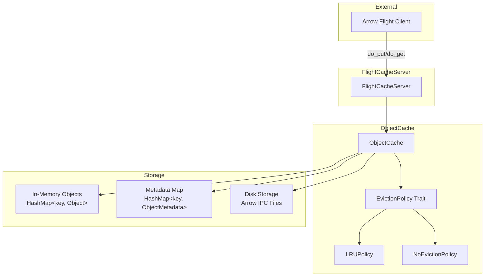
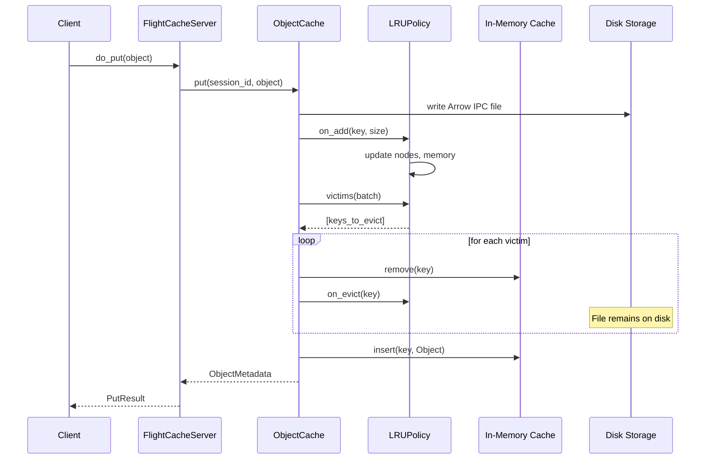

# Design Document: LRU Eviction Policy for ObjectCache

## 1. Motivation

**Background:**
Currently, the ObjectCache in Flame holds all object data in memory while also persisting them to local disk. The in-memory index (`HashMap<String, ObjectMetadata>`) grows unbounded as sessions and tasks accumulate. When there are many sessions and tasks, memory consumption becomes a critical issue, potentially leading to:

1. **Out-of-Memory (OOM) conditions**: The executor-manager process may be killed by the OS when memory is exhausted
2. **Performance degradation**: High memory pressure causes increased garbage collection and swapping
3. **Unpredictable behavior**: No control over which objects remain in memory

The current implementation (from RFE318) stores objects on disk using Arrow IPC format but maintains all metadata in memory. While objects can be loaded from disk on-demand, there's no mechanism to evict "cold" data from memory when resources are constrained.

**Target:**
This design aims to implement a memory management framework for ObjectCache that:

1. **Provides an extensible eviction policy interface** (`EvictionPolicy` trait) to support different eviction strategies
2. **Implements LRU (Least Recently Used) as the default policy** to automatically evict the oldest-accessed objects from memory
3. **Maintains disk persistence** - evicted objects remain on disk and can be reloaded on demand
4. **Ensures thread-safety** for concurrent access patterns
5. **Supports configurable memory limits** to control cache behavior

## 2. Function Specification

**Configuration:**

Add new configuration options under the `cache` section in `flame-cluster.yaml`:

```yaml
cache:
  endpoint: "grpc://127.0.0.1:9090"
  network_interface: "eth0"
  storage: "/var/lib/flame/cache"
  eviction:                          # New section
    policy: "lru"                    # Eviction policy: "lru" | "none" (default: "lru")
    max_memory: "1G"                 # Maximum memory for cached objects (default: "1G")
                                     # Supports units: B, K/KB, M/MB, G/GB, T/TB (case-insensitive)
    max_objects: 10000               # Maximum number of objects in memory (default: unlimited)
```

**Environment Variables:**
- `FLAME_CACHE_EVICTION_POLICY`: Override eviction policy ("lru" or "none")
- `FLAME_CACHE_MAX_MEMORY`: Override maximum memory limit (e.g., "2G", "512M")
- `FLAME_CACHE_MAX_OBJECTS`: Override maximum object count

**API:**

No changes to the external Arrow Flight API. The eviction policy operates transparently:
- `do_put`: Stores object, may trigger eviction of other objects
- `do_get`: Retrieves object, updates access time (may reload from disk if evicted)
- `do_action(DELETE)`: Removes object from both memory and disk

**CLI:**

No changes to CLI. The eviction policy is configured via `flame-cluster.yaml`.

**Scope:**

*In Scope:*
- `EvictionPolicy` trait definition with pluggable implementations
- `LRUPolicy` implementation as the default eviction strategy
- Configuration parsing for eviction settings using `bytesize` crate
- Thread-safe access time tracking
- Memory-based and count-based eviction triggers
- Automatic reload from disk for evicted objects

*Out of Scope:*
- Other eviction policies (LFU, FIFO, TTL-based) - can be added later using the trait
- Distributed cache coordination
- Per-session eviction policies
- Eviction callbacks/hooks for external systems
- Compression of cached objects

*Limitations:*
- Memory tracking is approximate (based on object data size, not total heap usage)
- Eviction decisions are made per-object, not per-session
- No preemptive eviction - eviction occurs only when limits are exceeded

**Feature Interaction:**

*Related Features:*
- **RFE318 Object Cache**: This feature extends the existing cache implementation
- **Session Management**: Objects are organized by session; eviction respects session boundaries for deletion but not for LRU ordering

*Updates Required:*
1. `ObjectCache` struct: Add eviction policy and access tracking
2. `FlameCache` config: Add `eviction` section parsing
3. `common/src/ctx.rs`: Update `FlameCache` and `FlameCacheYaml` structs

*Integration Points:*
- Eviction policy integrates with `ObjectCache::get()` and `ObjectCache::put()` methods
- Access time updates occur on every read/write operation
- Eviction check runs after each `put` operation

*Compatibility:*
- Backward compatible: If eviction config is not set, defaults to LRU with 1G limit
- No changes to Arrow Flight protocol or ObjectRef structure
- Existing cached data on disk remains accessible

*Breaking Changes:*
- **Behavioral change**: Previous versions had unbounded in-memory cache growth. This version defaults to LRU eviction with a 1GiB memory limit. Users who relied on unbounded memory behavior should explicitly configure `eviction.policy: "none"` to restore the previous behavior.


## 3. Implementation Detail

**Architecture:**



**Components:**

1. **EvictionPolicy Trait** (`object_cache/src/eviction.rs`)
   - Defines the interface for eviction strategies
   - Methods: `on_access()`, `on_evict()`, `on_add()`, `on_remove()`, `victims()`

2. **LRUPolicy** (`object_cache/src/eviction.rs`)
   - Implements `EvictionPolicy` trait
   - Maintains access order using a doubly-linked list + HashMap for O(1) operations
   - Tracks total memory usage and object count

3. **NoEvictionPolicy** (`object_cache/src/eviction.rs`)
   - Implements `EvictionPolicy` trait
   - No-op implementation for backward compatibility or testing

4. **ObjectCache** (updated)
   - Uses `HashMap<String, Object>` for in-memory cache
   - Uses `HashMap<String, ObjectMetadata>` for metadata tracking
   - Object presence in the cache HashMap indicates it's in memory
   - Object absence from cache (but present in metadata) indicates it's on disk only
   - Integrates eviction policy
   - Handles transparent reload from disk

**Data Structures:**

```rust
/// Eviction policy trait - defines the interface for cache eviction strategies
pub trait EvictionPolicy: Send + Sync {
    /// Record an access to an object (updates LRU order)
    fn on_access(&self, key: &str);
    
    /// Select objects to evict, returns keys in eviction order
    /// Returns empty Vec if no eviction is needed
    fn victims(&self, count: usize) -> Vec<String>;
    
    /// Called when an object is evicted
    fn on_evict(&self, key: &str);
    
    /// Called when an object is added
    fn on_add(&self, key: &str, size: u64);
    
    /// Called when an object is removed (deleted, not evicted)
    fn on_remove(&self, key: &str);
}

/// Configuration for eviction policy
#[derive(Debug, Clone, Deserialize)]
pub struct EvictionConfig {
    pub policy: Option<String>,       // "lru" or "none"
    pub max_memory: Option<String>,   // e.g., "1G", "512M", "2T" (parsed by bytesize crate)
    pub max_objects: Option<usize>,
}

/// LRU eviction policy implementation
pub struct LRUPolicy {
    /// Maximum memory in bytes (parsed from config string using bytesize crate)
    max_memory: u64,
    /// Maximum number of objects
    max_objects: Option<usize>,
    /// LRU nodes indexed by key (doubly-linked list + HashMap)
    nodes: MutexPtr<HashMap<String, LRUNode>>,
    /// Head of the list (least recently used)
    head: MutexPtr<Option<String>>,
    /// Tail of the list (most recently used)
    tail: MutexPtr<Option<String>>,
    /// Current memory usage
    current_memory: AtomicU64,
    /// Current object count
    current_count: AtomicUsize,
}
```

**Cache Storage Design:**

The cache uses two separate HashMaps instead of a wrapper struct:

- **`HashMap<String, Object>`**: In-memory cache for object data
  - If key exists → object is in memory
  - If key doesn't exist → object is NOT in memory (may be on disk)

- **`HashMap<String, ObjectMetadata>`**: Metadata tracking for all known objects
  - Tracks all objects regardless of memory/disk state
  - Used to determine if an object exists on disk when not in memory

This design is simpler and more efficient than using a wrapper struct with an `in_memory` flag.

**Memory Size Parsing:**

Memory sizes are parsed using the `bytesize` crate, which supports:
- Bytes: `512`, `512B`
- Kilobytes: `1024K`, `1024KB`, `1024k`, `1024kb`
- Megabytes: `512M`, `512MB`, `512m`, `512mb`
- Gigabytes: `1G`, `1GB`, `1g`, `1gb`
- Terabytes: `1T`, `1TB`, `1t`, `1tb`


**Algorithms:**

*LRU Access Recording (O(1)):*
```
1. Acquire lock on nodes, head, tail
2. If key exists in nodes:
   a. Remove key from current position in linked list
   b. Insert key at tail (most recently used)
3. Release locks
```

*Select Victims for Eviction:*
```
1. Check if current_memory > max_memory OR current_count > max_objects
2. If neither condition is true, return empty Vec (no eviction needed)
3. Acquire lock on nodes, head
4. Iterate from head (least recently used)
5. Collect up to 'count' keys
6. Return collected keys
7. Release locks
```

*Object Put with Eviction:*
```
1. Write object to disk (Arrow IPC)
2. Calculate object size
3. Call eviction_policy.on_add(key, size)
4. Get keys to evict: eviction_policy.victims(batch_size)
5. For each key in victims:
   a. Remove object from in-memory cache HashMap
   b. Call eviction_policy.on_evict(key)
   c. Keep on disk (do NOT delete file)
   d. Keep metadata in metadata HashMap
6. Add object to in-memory cache HashMap
7. Return ObjectMetadata
```

*Object Get with Reload:*
```
1. Call eviction_policy.on_access(key)
2. Check if object is in in-memory cache HashMap
3. If in memory:
   a. Return object
4. If not in memory, check metadata HashMap:
   a. If metadata exists (object on disk):
      i. Load from disk (Arrow IPC)
      ii. Add to in-memory cache HashMap
      iii. Call eviction_policy.on_add(key, size)
      iv. Get victims and evict if needed
      v. Return object
   b. If metadata doesn't exist:
      i. Return NotFound error
```

**Sequence Diagram - Put with Eviction:**



**System Considerations:**

*Performance:*
- LRU operations are O(1) using doubly-linked list + HashMap
- Eviction is batched to reduce lock contention
- Disk reload adds latency for evicted objects (~10-50ms)
- Memory tracking uses atomic operations for minimal overhead

*Scalability:*
- Memory limit prevents unbounded growth
- Object count limit provides additional control
- Eviction batch size is configurable for tuning

*Reliability:*
- Evicted objects remain on disk - no data loss
- Atomic file operations ensure consistency
- Graceful degradation under memory pressure

*Thread Safety:*
- `MutexPtr` (from stdng) protects linked list nodes
- Atomic counters for memory and object count
- Lock ordering prevents deadlocks: eviction_policy lock → cache lock

*Resource Usage:*
- Memory: Bounded by `max_memory` configuration
- CPU: Minimal overhead for LRU tracking
- Disk: No change - objects always persisted

**Dependencies:**

*New Dependencies:*
- `bytesize` crate for parsing memory size strings (e.g., "1G", "512M")

*Internal Dependencies:*
- `stdng`: MutexPtr, lock_ptr macro
- `common`: FlameCache, FlameError


## 4. Use Cases

**Example 1: Basic LRU Eviction**
- Description: Cache reaches memory limit, oldest objects are evicted
- Workflow:
  1. Cache configured with `max_memory: "100M"`
  2. Client stores objects A, B, C, D (each 30MB)
  3. After storing D, memory usage = 120MB > 100MB limit
  4. LRU policy's `victims()` returns [A] (oldest)
  5. A is removed from in-memory cache but remains on disk
  6. Memory usage = 90MB, within limit
- Expected outcome: Objects B, C, D in memory; A on disk only

**Example 2: Accessing Evicted Object**
- Description: Client requests an object that was evicted from memory
- Workflow:
  1. Object A was previously evicted (on disk only, not in cache HashMap)
  2. Client calls `get_object(ref_A)`
  3. Cache checks in-memory HashMap - key not found
  4. Cache checks metadata HashMap - key found (object exists on disk)
  5. Cache loads A from disk (Arrow IPC)
  6. A is added to in-memory cache HashMap, `on_access()` called
  7. If memory limit exceeded, `victims()` called to evict other objects
  8. A is returned to client
- Expected outcome: Object A returned, now in memory as most recent

**Example 3: High-Throughput Scenario**
- Description: Many concurrent requests with limited memory
- Workflow:
  1. Cache configured with `max_memory: "512M"`, `max_objects: 1000`
  2. Multiple clients storing/retrieving objects concurrently
  3. LRU policy tracks access order across all operations
  4. `victims()` called after each put to check for eviction
  5. Hot objects remain in memory, cold objects evicted to disk
- Expected outcome: Working set stays in memory, cold data on disk

**Example 4: No Eviction Policy**
- Description: Disable eviction for testing or specific use cases
- Workflow:
  1. Configure `eviction.policy: "none"`
  2. `victims()` always returns empty Vec
  3. All objects remain in memory indefinitely
  4. Memory grows unbounded (original behavior)
- Expected outcome: Backward-compatible behavior, no eviction

## 5. References

**Related Documents:**
- RFE318 Object Cache Design: `docs/designs/RFE318-cache/FS.md`
- Issue #366: Enable LRU policy in ObjectCache

**External References:**
- LRU Cache Algorithm: https://en.wikipedia.org/wiki/Cache_replacement_policies#LRU
- bytesize crate: https://docs.rs/bytesize/

**Implementation References:**
- ObjectCache: `object_cache/src/cache.rs`
- Eviction Policy: `object_cache/src/eviction.rs`
- Configuration: `common/src/ctx.rs`
