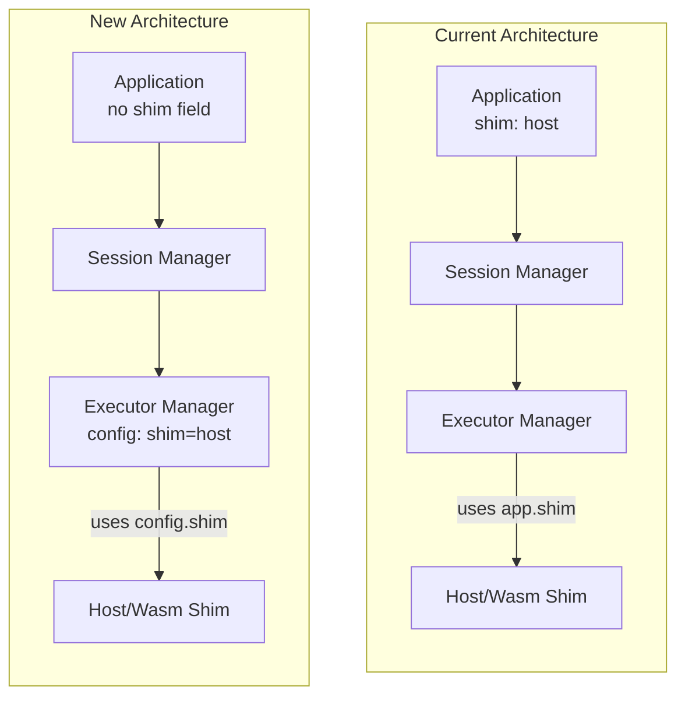
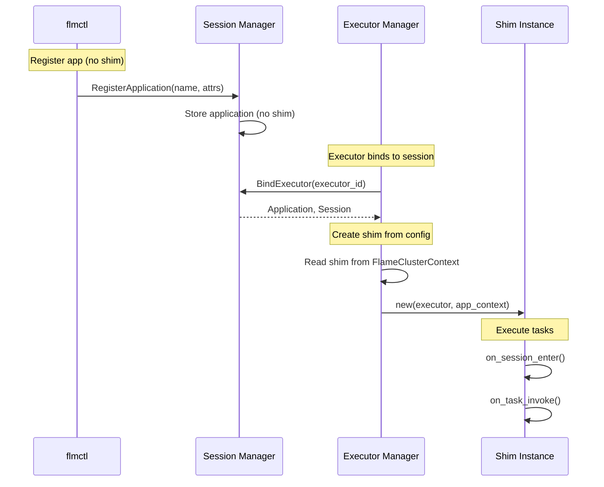

# Design Document: Configure Shim in ExecutorManager Instead of Application

## 1. Motivation

**Background:**

Currently, the `shim` configuration is defined as a field in `ApplicationSpec` (in `rpc/protos/types.proto`). This design has several issues:

1. **Separation of Concerns Violation**: The shim type (`Host` or `Wasm`) is a runtime environment concern that should be managed by the executor-manager, not by the application definition. Applications should focus on *what* to run (command, arguments, image), not *how* to run it.

2. **Operational Inflexibility**: When deploying the same application across different environments (e.g., development vs. production, or different node types), operators cannot easily change the shim type without modifying the application definition.

3. **Configuration Duplication**: The executor-manager already has a `shim` configuration in `FlameExecutors` (in `common/src/ctx.rs`), but it's currently only used as a default. Having shim configuration in two places creates confusion about which takes precedence.

4. **Tight Coupling**: The `ApplicationContext` struct carries shim information through the system, coupling application logic with runtime execution details.

**Target:**

This design aims to:

1. **Remove** the `shim` field from `ApplicationSpec` and related structures completely
2. **Centralize** shim configuration in the executor-manager's `flame-cluster.yaml`
3. **Simplify** the Application model by removing runtime-specific concerns
4. **Update CLI tools** to reflect the new configuration model

> **Note:** Since Flame is in alpha release, backward compatibility is not required. The `shim` field is removed directly without a deprecation period.

## 2. Function Specification

**Configuration:**

The shim configuration will be exclusively managed in the executor-manager's configuration file (`flame-cluster.yaml`):

```yaml
# Current configuration (already exists)
executors:
  shim: host                    # "host" or "wasm" (default: "host")
  limits:
    max_executors: 128
```

No changes to the configuration format are required. The existing `executors.shim` field will become the authoritative source for shim selection.

**API:**

*Changes to Protocol Buffers (`rpc/protos/types.proto`):*

```protobuf
// BEFORE: Shim is part of ApplicationSpec
message ApplicationSpec {
  Shim shim = 1;                    // REMOVED
  optional string description = 2;
  // ... other fields
}

// AFTER: Shim removed from ApplicationSpec
message ApplicationSpec {
  reserved 1;                       // Reserved for wire compatibility
  reserved "shim";
  optional string description = 2;
  // ... other fields
}
```

*Changes to `ApplicationContext` (`rpc/protos/shim.proto`):*

```protobuf
// BEFORE
message ApplicationContext {
    string name = 1;
    Shim shim = 2;                  // REMOVED
    optional string image = 3;
    // ...
}

// AFTER
message ApplicationContext {
    string name = 1;
    reserved 2;                     // Reserved for wire compatibility
    reserved "shim";
    optional string image = 3;
    // ...
}
```

**CLI:**

*Changes to `flmctl`:*

1. **`flmctl list application`**: Remove the `SHIM` column from output
2. **`flmctl view application`**: Remove shim from application details
3. **`flmctl register application`**: The `shim` field is no longer accepted in YAML

*Example output changes:*

```bash
# BEFORE
$ flmctl list application
NAME        SHIM    IMAGE           COMMAND
my-app      host    python:3.11     python

# AFTER
$ flmctl list application
NAME        IMAGE           COMMAND
my-app      python:3.11     python
```

**Other Interfaces:**

*Python SDK (`sdk/python`):*
- Remove `shim` field from `ApplicationSpec` and `ApplicationContext` protobuf messages
- Update documentation to reflect the change

*Rust SDK (`sdk/rust`):*
- Remove `shim` field from `ApplicationSpec` and `ApplicationContext` protobuf messages
- Update `Application` struct to not include shim

**Scope:**

*In Scope:*
- Remove `shim` field from `ApplicationSpec` protobuf message
- Remove `shim` from `ApplicationContext` protobuf message
- Update `common/src/apis.rs` to remove shim from Application-related structs
- Update executor-manager to use only `FlameExecutors.shim` configuration
- Update `flmctl` to remove shim from list/view commands
- Update `flmctl` to not accept shim field in application YAML
- Update shim selection logic in `executor_manager/src/shims/mod.rs`
- Update SDK protobuf files (Python and Rust)

*Out of Scope:*
- Adding per-session or per-task shim configuration
- Supporting multiple shim types on the same executor-manager
- Dynamic shim switching at runtime

*Limitations:*
- All executors on a single executor-manager node will use the same shim type
- Changing shim type requires restarting the executor-manager

**Feature Interaction:**

*Related Features:*
- **Session Management**: Sessions reference applications but don't need shim info
- **Task Execution**: Tasks are executed using the shim configured in executor-manager
- **Object Cache**: No impact - cache is independent of shim type

*Updates Required:*

| Component | File | Change |
|-----------|------|--------|
| RPC | `rpc/protos/types.proto` | Remove `shim` from `ApplicationSpec` |
| RPC | `rpc/protos/shim.proto` | Remove `shim` from `ApplicationContext` |
| SDK Python | `sdk/python/protos/types.proto` | Remove `shim` from `ApplicationSpec` |
| SDK Python | `sdk/python/protos/shim.proto` | Remove `shim` from `ApplicationContext` |
| SDK Rust | `sdk/rust/protos/types.proto` | Remove `shim` from `ApplicationSpec` |
| SDK Rust | `sdk/rust/protos/shim.proto` | Remove `shim` from `ApplicationContext` |
| Common | `common/src/apis.rs` | Remove `shim` from `Application`, `ApplicationAttributes`, `ApplicationContext` |
| Executor Manager | `executor_manager/src/shims/mod.rs` | Get shim from executor context, not app |
| CLI | `flmctl/src/list.rs` | Remove shim column |
| CLI | `flmctl/src/view.rs` | Remove shim from output |
| CLI | `flmctl/src/apis.rs` | Remove shim from `SpecYaml` |

*Compatibility:*

**Breaking Changes (Alpha Release):**

Since Flame is in alpha release, backward compatibility is not required. The following breaking changes are made directly:

- **API Change**: The `shim` field is removed from `ApplicationSpec` and `ApplicationContext` protobuf messages
- **Behavioral Change**: Applications can no longer specify shim type; executor-manager's configured shim is always used
- **CLI Change**: `flmctl list application` output format changes (fewer columns)
- **YAML Change**: Application YAML files should not include `shim` field

## 3. Implementation Detail

**Architecture:**



**Components:**

1. **Executor Manager (`executor_manager/src/shims/mod.rs`)**
   - Currently: `new()` function reads shim from executor's cluster context configuration
   - No change needed - already implemented correctly

2. **Common APIs (`common/src/apis.rs`)**
   - `shim` field already removed from `Application`, `ApplicationAttributes`, `ApplicationContext`
   - Comments updated to indicate removal

3. **Protocol Buffers (`rpc/protos/`)**
   - Fields marked as reserved to maintain wire compatibility
   - Generated code updated

4. **SDK Protocol Buffers (`sdk/python/protos/`, `sdk/rust/protos/`)**
   - Fields marked as reserved to maintain wire compatibility

5. **CLI (`flmctl/src/`)**
   - `shim` field removed from `SpecYaml` struct
   - List and view commands already updated

**Data Flow (After Change):**



**Data Structures:**

*Before:*
```rust
// common/src/apis.rs
pub struct ApplicationContext {
    pub name: String,
    pub image: Option<String>,
    pub command: Option<String>,
    pub arguments: Vec<String>,
    pub working_directory: Option<String>,
    pub environments: HashMap<String, String>,
    pub url: Option<String>,
    pub shim: Shim,  // REMOVED
}
```

*After:*
```rust
// common/src/apis.rs
pub struct ApplicationContext {
    pub name: String,
    pub image: Option<String>,
    pub command: Option<String>,
    pub arguments: Vec<String>,
    pub working_directory: Option<String>,
    pub environments: HashMap<String, String>,
    pub url: Option<String>,
    // shim removed - now in FlameExecutors config
}
```

**Key Code Changes:**

*`executor_manager/src/shims/mod.rs`:*
```rust
/// Create a new shim instance based on executor's cluster context configuration.
/// The shim type is determined by the executor-manager's flame-cluster.yaml config,
/// not from the application context (which has been removed).
pub async fn new(executor: &Executor, app: &ApplicationContext) -> Result<ShimPtr, FlameError> {
    // Get shim type from executor's cluster context configuration
    let shim_type = executor
        .context
        .as_ref()
        .map(|ctx| ctx.executors.shim)
        .unwrap_or(ShimType::Host);

    tracing::info!(
        "Creating shim for executor <{}> with type: {:?} (from executor-manager config)",
        executor.id,
        shim_type
    );

    match shim_type {
        ShimType::Wasm => Ok(WasmShim::new_ptr(executor, app).await?),
        ShimType::Host => Ok(HostShim::new_ptr(executor, app).await?),
    }
}
```

**System Considerations:**

*Performance:*
- No performance impact - shim selection happens once per session binding
- Slightly simpler code path (no need to extract shim from Application)

*Scalability:*
- No impact on scalability
- Simplifies multi-node deployments where different nodes can have different shim configs

*Reliability:*
- Improved reliability - single source of truth for shim configuration
- Reduces configuration errors from mismatched Application/ExecutorManager settings

*Security:*
- No security impact
- Operators have more control over runtime environment

*Observability:*
- Logging shows shim type from config, not from application
- Startup log message shows configured shim type

**Dependencies:**

*Internal Dependencies:*
- `common`: FlameClusterContext, FlameExecutors
- `rpc`: Protocol buffer definitions
- `executor_manager`: Shim selection logic

*No new external dependencies required.*

## 4. Use Cases

**Example 1: Basic Application Registration (After Change)**

*Description:* Register an application without specifying shim

*Application YAML:*
```yaml
metadata:
  name: pi-calculator
spec:
  image: python:3.11
  command: python
  arguments: ["-m", "pi_calc"]
  # Note: 'shim' field is not supported
```

*Workflow:*
1. User runs `flmctl register application -f app.yaml`
2. Application is stored without shim information
3. When executor binds to a session using this application:
   - Executor-manager reads `executors.shim` from its config
   - Creates appropriate shim instance (Host or Wasm)
4. Tasks execute using the configured shim

*Expected outcome:* Application runs using executor-manager's configured shim type

**Example 2: Different Shim Types Across Nodes**

*Description:* Deploy same application on nodes with different shim configurations

*Scenario:*
- Node A: `executors.shim: host` (for CPU-intensive tasks)
- Node B: `executors.shim: wasm` (for sandboxed execution)

*Workflow:*
1. Same application registered once (no shim in spec)
2. Session created, tasks submitted
3. Scheduler assigns tasks to available executors
4. Node A executors use Host shim
5. Node B executors use Wasm shim
6. Same application code runs in different runtime environments

*Expected outcome:* Operational flexibility without application changes

## 5. References

**Related Documents:**
- Issue #368: Configure shim in flame-executor-manager instead of Application
- `docs/designs/templates.md`: Design document template

**Implementation References:**
- Current shim selection: `executor_manager/src/shims/mod.rs`
- Application definition: `rpc/protos/types.proto`
- Executor configuration: `common/src/ctx.rs`
- CLI application commands: `flmctl/src/list.rs`, `flmctl/src/view.rs`

**External References:**
- Protocol Buffers reserved fields: https://protobuf.dev/programming-guides/proto3/#reserved
