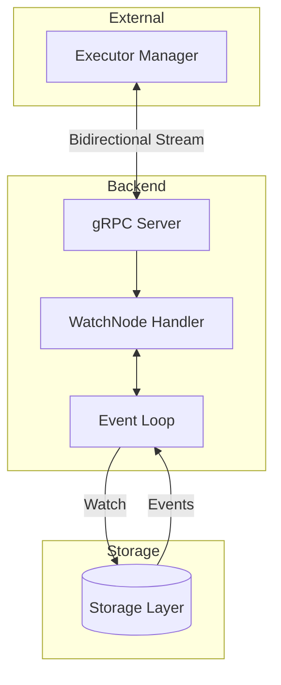
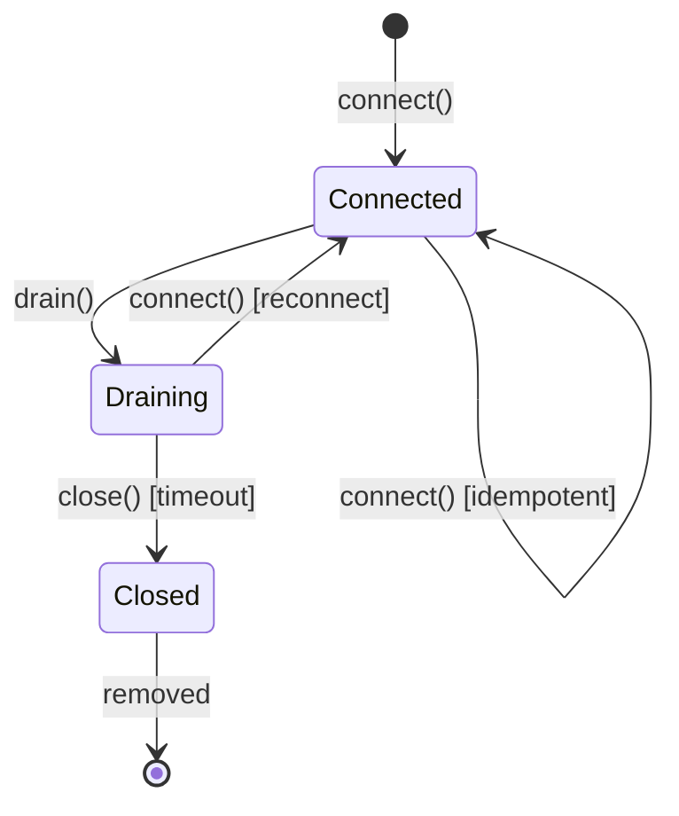
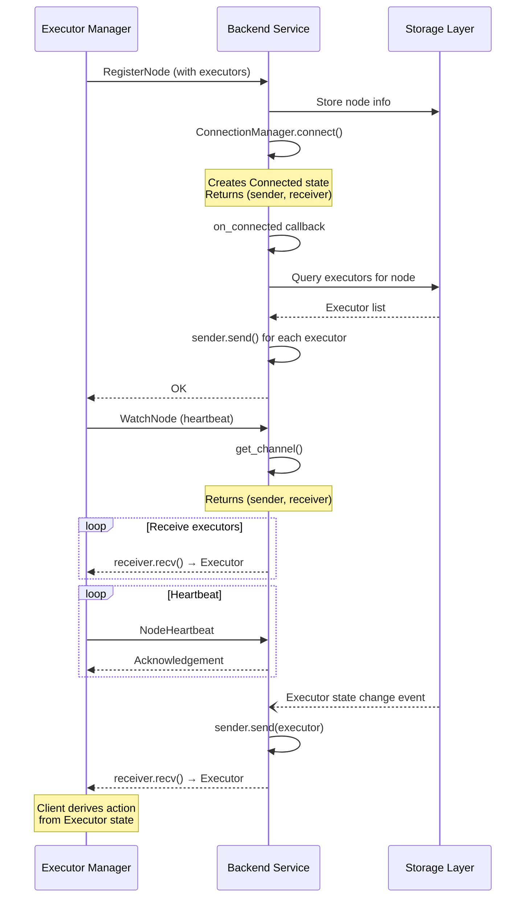
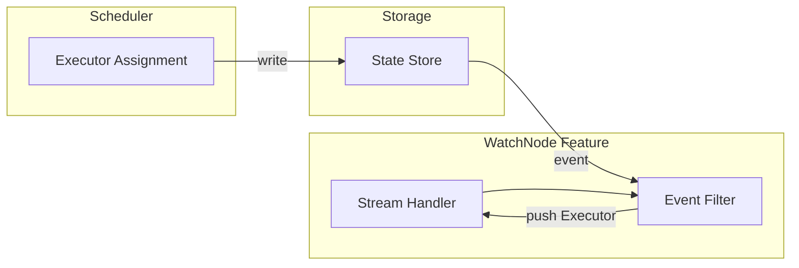

# WatchNode Streaming

## 1. Motivation

**Background:**
The current polling mechanism for node status updates is inefficient and introduces latency. We need a streaming API to push updates to clients in real-time.

**Target:**
- Reduce latency for node status updates.
- Reduce load on the API server by eliminating polling.
- Provide a reliable stream of events to clients.

## 2. Function Specification

**Configuration:**
- `heartbeat_interval`: The interval at which the client sends heartbeats (default: 5s).
- `stream_timeout`: The duration after which the server closes the stream if no heartbeat is received (default: 30s).

**API:**

**Proto Definition:**

```protobuf
service Backend {
    // ... existing methods ...

    // WatchNode streams executor updates for a specific node.
    // Bidirectional: client sends registration + heartbeats, server pushes executor state.
    rpc WatchNode(stream WatchNodeRequest) returns (stream WatchNodeResponse);
}

message WatchNodeRequest {
    oneof request {
        NodeRegistration registration = 1;  // Initial registration
        NodeHeartbeat heartbeat = 2;        // Periodic heartbeat with node status
    }
}

message NodeRegistration {
    Node node = 1;
}

message NodeHeartbeat {
    string node_name = 1;
    NodeStatus status = 2;
}

message WatchNodeResponse {
    oneof response {
        Executor executor = 1;       // Executor object (state-based, not action-based)
        Acknowledgement ack = 2;     // Heartbeat acknowledgement
    }
}

message Acknowledgement {
    int64 timestamp = 1;
}
```

**Design Note:** The server returns raw `Executor` objects directly, not wrapped in an action enum. This state-based approach is simpler and more flexible than an action-based approach (e.g., CREATE/UPDATE/DELETE). The client derives the appropriate action by comparing the received executor state with its local cache.

**Behavior:**
1.  **Connection:** The client establishes a bidirectional gRPC stream by calling `WatchNode`.
2.  **Registration:** The client sends a `NodeRegistration` message with node information.
3.  **Initial State:** The server sends the current state of all executors for the node.
4.  **Heartbeats:** The client sends periodic `NodeHeartbeat` messages with current node status.
5.  **Updates:** The server sends an `Executor` message whenever an executor's state changes.
6.  **Client-Side Action Derivation:** The server sends raw `Executor` objects. The client is responsible for deriving the necessary action based on the executor's state and its local cache:
    - If the executor state is `ExecutorReleasing` or `ExecutorReleased` → The client must terminate/delete the executor.
    - If the executor ID is new to the client → The client must create/launch the executor.
    - If the executor ID is already known → The client must update the existing executor.
7.  **Termination:** The stream remains open until the client cancels it or the server shuts down.

**CLI:**
N/A - This is a backend API change.

**Other Interfaces:**
- **Protocol:** gRPC Bidirectional Streaming.

**Scope:**
- **In Scope:**
    - Implementation of `WatchNode` RPC in Backend.
    - Client-side logic for registration, heartbeating, and handling updates.
- **Out of Scope:**
    - Changes to the scheduling logic itself.
- **Limitations:**
    - Scalability is limited by the number of concurrent gRPC streams the server can handle.

**Feature Interaction:**
- **Related Features:** Node Registration, Executor Scheduling.
- **Updates Required:**
    - Backend: Implement `WatchNode` handler.
    - Executor Manager: Switch from polling to streaming.
- **Integration Points:**
    - The backend integrates with the storage layer to watch for executor changes.
- **Compatibility:**
    - **Breaking Change:** Polling mode is removed. All clients must use streaming.
- **Breaking Changes:** Polling mode removed.

## 3. Implementation Detail

**Architecture:**
The backend maintains an event loop that listens for changes in the storage layer. When a change is detected, it filters the event and pushes the `Executor` object to the relevant connected clients via the gRPC stream.



**Components:**
- **Backend Service:** Hosts the `WatchNode` RPC.
- **Storage Layer:** Source of truth for executor state.
- **Executor Manager:** Client that consumes the stream and derives actions from received `Executor` objects.
- **ConnectionManager:** Manages all node connections using the State Pattern (see [CONNECTION_STATE_MACHINE.md](CONNECTION_STATE_MACHINE.md)).

**Connection State Machine:**

The connection lifecycle is managed through a state machine with three states:



- **Connected**: Node is connected, can send/receive via sender/receiver handles
- **Draining**: Node disconnected, drain timer running (default 30s), can reconnect
- **Closed**: Connection permanently closed, removed from registry

**Channel Pattern:**

The connection uses a channel pattern with separate sender/receiver handles for async-safe communication:

```rust
// ConnectionManager returns handles directly, no lock needed at call site
let (sender, receiver) = connection_manager.connect(node_name).await?;

// Sender: push executor updates to node
sender.send(executor).await?;

// Receiver: pop executor updates from queue  
while let Some(executor) = receiver.recv().await {
    // process executor
}
```



**Feature Interaction (Implementation):**

- **Shared State:**
    - Node registry: Shared with node registration feature
    - Executor state cache: Shared with scheduler
    - Active stream connections: Managed per-node in memory

- **Event Flow:**
    - Storage emits executor state change events
    - Event loop filters events by node
    - Raw `Executor` objects pushed to relevant streams
    - Client compares with local cache to derive action
    - Order: Registration → Initial sync → Heartbeats + Updates

- **Call Chains:**


- **Error Propagation:**
    - Stream errors are isolated per-connection
    - Storage errors trigger stream reconnection
    - Client handles errors via exponential backoff

- **Feature Flags:**
    - None. Streaming is mandatory.

**Data Structures:**
- `WatchNodeRequest` / `WatchNodeResponse` (defined in API).
- `Executor`: The core data structure sent over the stream, containing executor ID, state, and metadata.

**Algorithms:**
- **Event Loop & Listening:**
    - The backend uses a `tokio::sync::broadcast` channel (or similar internal event bus) to subscribe to executor state changes.
    - When the Scheduler or API updates an executor in the Storage Layer, an event is published to this channel.
    - The `WatchNode` handler subscribes to this channel.
    - For each event, the handler checks if the executor belongs to the connected node.
    - If it matches, the `Executor` object is serialized and pushed to the gRPC stream.
- **Client-Side Action Derivation:**
    - The client maintains a local cache of known executors.
    - When an `Executor` is received:
        - Check executor state: if `ExecutorReleasing` or `ExecutorReleased`, delete locally.
        - Check local cache: if executor ID is unknown, create/launch it.
        - Otherwise, update the existing executor with new state.
- **Concurrency:**
    - Each stream runs in its own `tokio::task` to ensure isolation.
- **Reconnection:**
    - The client implements exponential backoff for reconnection on stream failure.

**System Considerations:**
- **Performance:**
    - Expected to significantly reduce latency compared to polling.
    - Throughput depends on the frequency of executor state changes.
- **Scalability:**
    - Horizontal scaling of backend services is supported. Clients connect to any backend instance.
- **Reliability:**
    - Heartbeats ensure connection health.
    - Client must handle stream disconnects and re-register.
- **Resource Usage:**
    - Memory usage per stream should be minimal.
    - Network usage is proportional to state changes + heartbeats.
- **Security:**
    - Standard mTLS authentication for gRPC.
- **Observability:**
    - Metrics: `watch_node_active_streams`, `watch_node_events_sent`, `watch_node_heartbeat_latency`
    - Logging: Stream connect/disconnect events, error conditions
    - Tracing: Distributed trace IDs propagated through stream messages
- **Operational:**
    - Graceful shutdown: Drain streams before termination
    - Health checks: Stream count and heartbeat success rate
    - Disaster recovery: Clients auto-reconnect; no persistent stream state required

**Dependencies:**
- gRPC framework (Tonic).

## 4. Use Cases

**Basic Use Cases:**

**Example 1: Node Registration and Initial Sync**
- **Description:** A new node comes online and connects to the backend.
- **Workflow:**
    1. Executor Manager starts up.
    2. Calls `WatchNode`.
    3. Sends `NodeRegistration`.
    4. Backend validates and sends current list of `Executor` objects for this node.
    5. Executor Manager reconciles local state (creates executors for unknown IDs).
- **Expected Outcome:** Node is registered and has up-to-date executor list.

**Example 2: Executor State Update**
- **Description:** An executor is scheduled on the node.
- **Workflow:**
    1. Scheduler assigns Executor E1 to Node N1.
    2. Storage layer emits event.
    3. Backend receives event via internal event bus.
    4. Backend pushes `Executor` object to N1's stream.
    5. Executor Manager receives `Executor`, checks local cache (E1 unknown), starts E1.
- **Expected Outcome:** Executor Manager starts the executor immediately.

**Example 3: Heartbeat**
- **Description:** Keeping the connection alive.
- **Workflow:**
    1. Executor Manager sends `NodeHeartbeat` every 5s.
    2. Backend updates node's last-seen timestamp.
    3. Backend sends `Acknowledgement`.
- **Expected Outcome:** Connection remains active; node is marked as healthy.

**Example 4: Executor Termination**
- **Description:** An executor is released and needs to be terminated.
- **Workflow:**
    1. Scheduler releases Executor E1 (sets state to `ExecutorReleasing`).
    2. Storage layer emits event.
    3. Backend pushes `Executor` object (with `ExecutorReleasing` state) to N1's stream.
    4. Executor Manager receives `Executor`, checks state, terminates E1 locally.
- **Expected Outcome:** Executor Manager terminates the executor based on state.

**Advanced Use Cases:**

**Example 5: Stream Reconnection**
- **Description:** Handling network interruption.
- **Workflow:**
    1. Network partition occurs.
    2. Stream disconnects.
    3. Executor Manager detects disconnect.
    4. Executor Manager waits (exponential backoff).
    5. Executor Manager reconnects and re-registers.
    6. Backend sends full executor state (all `Executor` objects).
    7. Executor Manager reconciles by comparing with local cache.
- **Expected Outcome:** Node recovers and resumes normal operation.

## 5. References

**Related Documents:**
- [RFE-17 Issue Description](http://gitea:3000/xflops/flame/issues/17)
- [NodeConnection State Machine](CONNECTION_STATE_MACHINE.md) - Detailed design for connection lifecycle management

**External References:**
- [Tonic gRPC Streaming Documentation](https://github.com/hyperium/tonic/blob/master/examples/src/streaming/server.rs)

**Implementation References:**
- Backend API: `session_manager/src/apiserver/backend.rs`
- Controller: `session_manager/src/controller/mod.rs`
  - `register_node()` - Creates connection, syncs executors
  - `get_node_channel()` - Returns (sender, receiver) handles
  - `drain_node()` - Starts drain timer
- Connection State Machine: `session_manager/src/controller/connections/`
  - `mod.rs` - ConnectionStates trait and from() factory
  - `manager.rs` - ConnectionManager (connect, get_channel, drain)
  - `connected.rs` - ConnectedState
  - `draining.rs` - DrainingState
  - `closed.rs` - ClosedState
- Connection Types: `session_manager/src/model/connection/mod.rs`
  - NodeConnection - Connection data with internal queue
  - NodeConnectionSender - Async-safe sender handle
  - NodeConnectionReceiver - Async-safe receiver handle
  - ConnectionState - Connected, Draining, Closed
  - ConnectionCallbacks - on_connected, on_draining, on_closed
- Executor Manager: `executor_manager/src/client/stream_client.rs`
