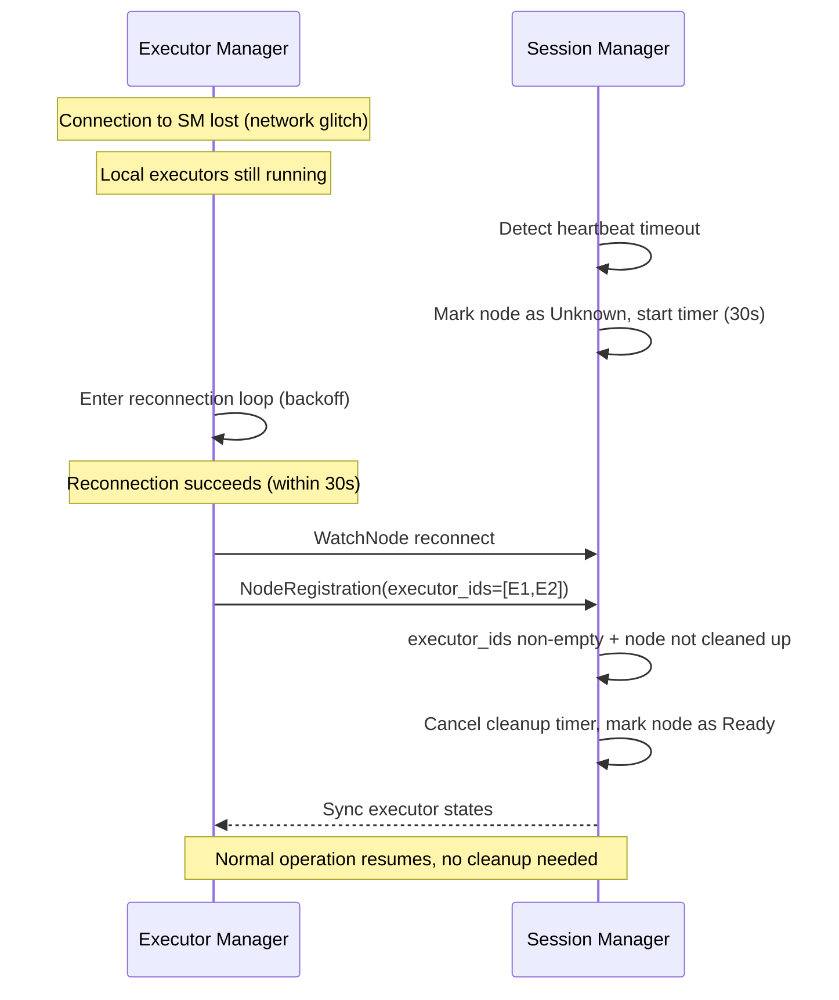
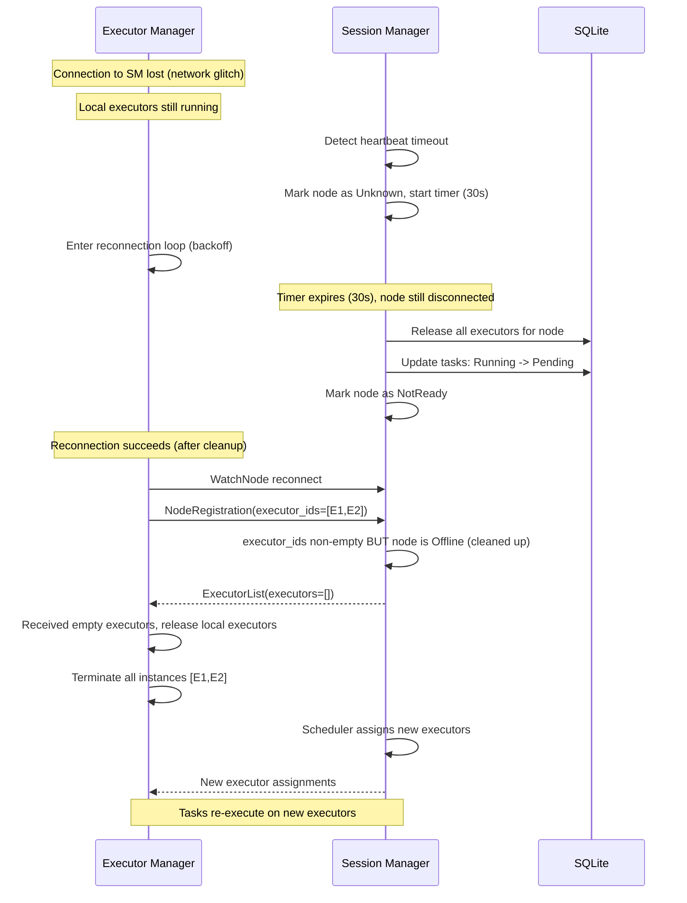
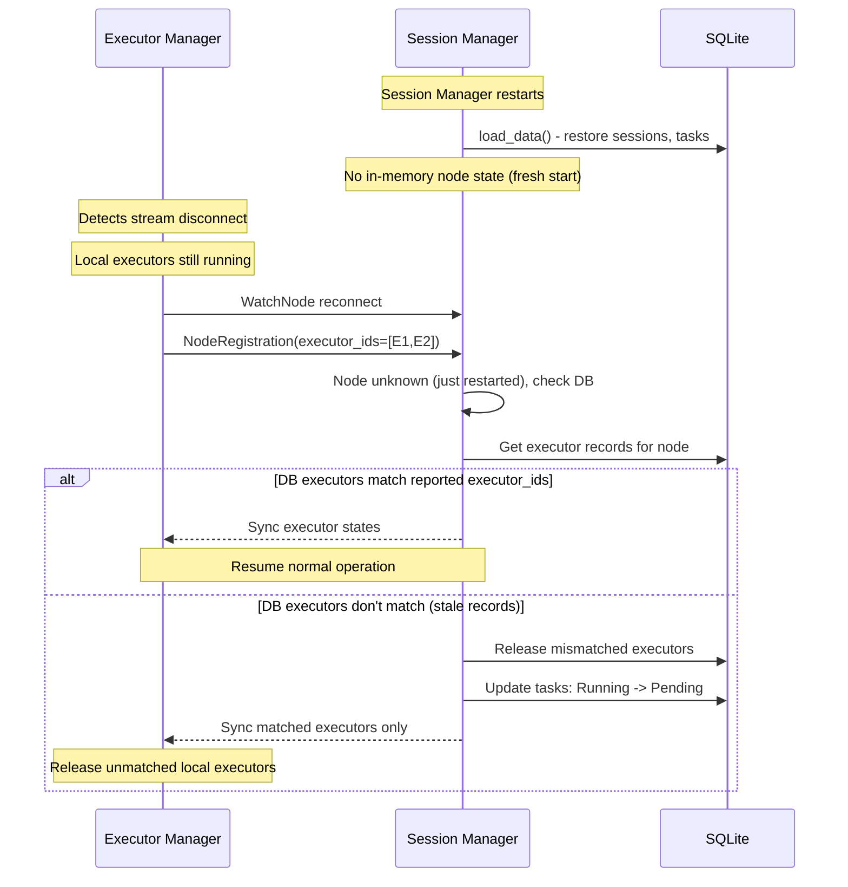
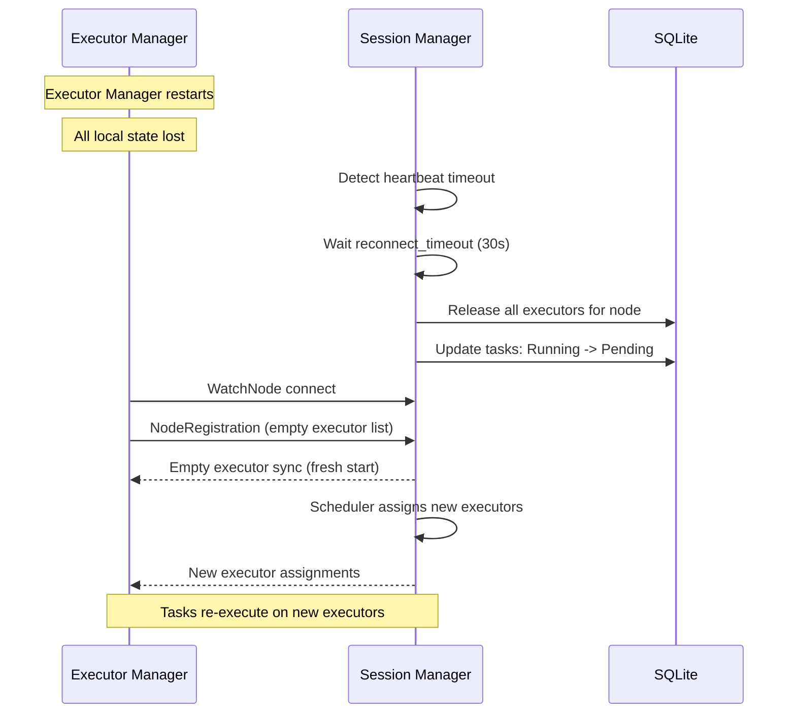
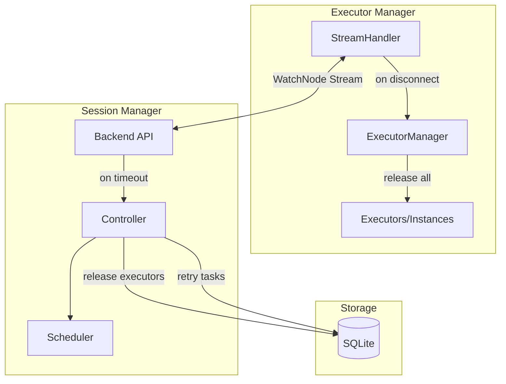

# Enhance Flame Recovery

## 1. Motivation

**Background:**
Currently, if either `flame-session-manager` or `flame-executor-manager` restarts, the system cannot properly recover:

1. **Session Manager Restart**: Executor managers lose connection and cannot reconnect properly. Executors and tasks become orphaned.

2. **Executor Manager Restart**: Session manager still holds stale executor records. Running tasks are not retried.

3. **Connection Failure**: When connection between executor_manager and session_manager fails, there's no cleanup or recovery mechanism.

**Target:**
- Simple, predictable recovery: on connection failure, release all executors and instances, retry tasks.
- Minimize complexity by avoiding state reconciliation.
- Ensure tasks eventually complete via retry mechanism.

## 2. Function Specification

**Configuration:**

| Parameter                    | Description                                          | Default |
| ---------------------------- | ---------------------------------------------------- | ------- |
| `recovery.task_retry_limit`  | Maximum retry attempts for a failed task             | `3`     |
| `recovery.reconnect_timeout` | Time to wait before treating disconnect as permanent | `30s`   |

**API:**

No proto changes required. The recovery mechanism uses existing APIs.

**Behavior:**

**Core Principle:** On connection failure, use `executor_ids` in `NodeRegistration` to determine recovery path:

| executor_ids | Node State | Meaning | Action |
|--------------|------------|---------|--------|
| Non-empty | Ready/Unknown | Network glitch, executors still running | Sync state, resume |
| Non-empty | NotReady (cleaned up) | Reconnect after timeout | Release local executors, fresh start |
| Empty | Any | Executor manager restarted | Clean up DB records, fresh start |

**Node State Mapping:**
- `Ready` = Node connected and streaming
- `Unknown` = Node disconnected, cleanup timer running (we don't know the actual state)
- `NotReady` = Node cleanup completed after timeout

**Scenario 1a: Network Glitch, Reconnects Before Timeout (No Cleanup)**



**Scenario 1b: Network Glitch, Timeout Expires (Full Cleanup)**



**Scenario 2: Session Manager Restart**



**Scenario 3: Executor Manager Restart**



**CLI:**
N/A - Recovery is automatic.

**Scope:**

- **In Scope:**
    - Executor/instance release on connection failure (both sides)
    - Task retry via Pending state reset
    - Reconnection with fresh state

- **Out of Scope:**
    - State reconciliation (explicitly avoided for simplicity)
    - Task checkpointing/resumption
    - Executor reuse across restarts

- **Limitations:**
    - All in-progress tasks restart from beginning on any connection failure
    - Brief unavailability window during recovery

**Feature Interaction:**

- **Related Features:**
    - WatchNode Streaming (RFE-370): Connection mechanism
    - Scheduler: Assigns new executors after cleanup

- **Updates Required:**
    - `StreamHandler` (executor_manager): Release executors on disconnect
    - `Backend` (session_manager): Release executors on heartbeat timeout
    - `Storage`: Batch update tasks to Pending state

- **Breaking Changes:** None

## 3. Implementation Detail

**Architecture:**



**Components:**

| Component                              | Change                                                                  |
| -------------------------------------- | ----------------------------------------------------------------------- |
| **StreamHandler** (executor_manager)   | On disconnect: enter reconnection loop (keep local executors alive)     |
| **StreamHandler** (executor_manager)   | On empty sync response: call `ExecutorManager::release_all()`           |
| **ExecutorManager** (executor_manager) | New `release_all()` method to terminate all executors and instances     |
| **Backend** (session_manager)          | On heartbeat timeout: start cleanup timer                               |
| **Backend** (session_manager)          | On reconnect: reconcile based on executor_ids and node state            |
| **Controller** (session_manager)       | New `cleanup_node()` method to release executors and retry tasks        |
| **Storage** (session_manager)          | New `release_executors_for_node()` and `retry_tasks_for_node()` methods |

**Algorithms:**

**Executor Manager - On Disconnect:**
```
function on_stream_disconnect():
    log.info("Connection lost, entering reconnection loop")
    // Keep local executors running - they may still be doing work
    // Only release if session_manager tells us to (via empty sync)
    reconnect_with_backoff()

function on_reconnect_response(response):
    if response.is_empty_sync or response.node_cleaned_up:
        log.info("Session manager cleaned up, releasing local executors")
        release_all_executors()
    else:
        log.info("Resuming with existing executors")
        sync_executor_states(response.executors)

function release_all_executors():
    for executor in executor_manager.executors:
        executor.release()      // Transition to Releasing state
        executor.terminate()    // Kill the instance
    executor_manager.executors.clear()
```

**Session Manager - On Heartbeat Timeout:**
```
function on_heartbeat_timeout(node_name):
    log.info("Heartbeat timeout for node {}", node_name)
    
    // Mark node as disconnected, start cleanup timer
    node.state = Disconnected
    node.cleanup_timer = schedule_after(config.reconnect_timeout, || {
        if node.state == Disconnected:
            cleanup_node(node_name)
    })

function on_node_reconnect(node_name, reported_executor_ids):
    node = storage.get_node(node_name)
    
    // Case 1: Node reconnected before timeout
    if node != None and node.state == Disconnected:
        cancel(node.cleanup_timer)
        node.state = Online
        log.info("Node {} reconnected before cleanup", node_name)
        return SyncCurrentState(storage.get_executors_for_node(node_name))
    
    // Case 2: Node reconnected after cleanup (node.state == Offline)
    if node != None and node.state == Offline:
        node.state = Online
        log.info("Node {} reconnected after cleanup, starting fresh", node_name)
        return EmptySync(node_cleaned_up=true)
    
    // Case 3: Session manager just restarted (node unknown in memory)
    if node == None:
        return reconcile_after_sm_restart(node_name, reported_executor_ids)

function reconcile_after_sm_restart(node_name, reported_executor_ids):
    db_executors = storage.get_executors_for_node(node_name)
    db_executor_ids = Set(db_executors.map(e => e.id))
    reported_set = Set(reported_executor_ids)
    
    // Find mismatches
    orphaned_in_db = db_executor_ids - reported_set      // In DB but not reported
    unknown_local = reported_set - db_executor_ids       // Reported but not in DB
    matched = db_executor_ids & reported_set             // Both agree
    
    // Clean up orphaned DB records
    for executor_id in orphaned_in_db:
        storage.release_executor(executor_id)
        retry_tasks_for_executor(executor_id)
    
    // Unknown local executors will be released by executor_manager
    // when it receives sync without those IDs
    
    storage.create_or_update_node(node_name, state=Online)
    
    if matched.is_empty():
        return EmptySync(node_cleaned_up=true)
    else:
        return SyncExecutors(storage.get_executors(matched))

function cleanup_node(node_name):
    // Release all executors for this node
    executors = storage.get_executors_for_node(node_name)
    for executor in executors:
        storage.update_executor_state(executor.id, ExecutorState::Released)
    
    // Retry all running tasks for these executors
    for executor in executors:
        tasks = storage.get_running_tasks(executor.id)
        for task in tasks:
            if task.retry_count < config.task_retry_limit:
                task.retry_count += 1
                storage.update_task_state(task.id, TaskState::Pending)
            else:
                storage.update_task_state(task.id, TaskState::Failed)
                log.warn("Task {} exceeded retry limit", task.id)
    
    // Remove executor records
    storage.delete_executors_for_node(node_name)
    
    log.info("Cleaned up {} executors for node {}", executors.len(), node_name)
```

**System Considerations:**

- **Performance:** Cleanup is O(executors × tasks) per node, acceptable for recovery path
- **Reliability:** Simple state machine - always goes to "released" on failure, tasks always retry
- **Observability:**
    - Metrics: `flame_recovery_cleanups_total{node}`, `flame_recovery_tasks_retried_total`
    - Logging: INFO on cleanup start/complete, WARN on retry limit exceeded

**Dependencies:**
- No new dependencies

## 4. Use Cases

**Example 1: Brief Network Blip (Reconnects Before Timeout)**
- **Description:** Temporary network issue causes disconnect, recovers quickly
- **Workflow:**
    1. Network issue causes stream disconnect
    2. Session manager starts 30s cleanup timer
    3. Network recovers at 10s, executor manager reconnects
    4. Session manager cancels cleanup timer
    5. Executor states synced, normal operation resumes
- **Expected Outcome:** No cleanup, no task retry, seamless recovery

**Example 2: Extended Network Outage (Timeout Expires)**
- **Description:** Network issue lasts longer than timeout
- **Workflow:**
    1. Network issue causes stream disconnect
    2. Session manager starts 30s cleanup timer
    3. Timer expires, session manager cleans up node
    4. Network recovers at 45s, executor manager reconnects
    5. Session manager returns empty sync (node was cleaned up)
    6. Executor manager releases stale local executors
    7. Fresh executor assignments, tasks retry
- **Expected Outcome:** Tasks complete after retry; clean recovery

**Example 3: Executor Manager Crash**
- **Description:** Executor manager process crashes
- **Workflow:**
    1. Process crashes, all local state lost
    2. Session manager detects timeout, starts 30s timer
    3. Timer expires, cleans up node state
    4. Executor manager restarts, connects fresh
    5. New executors assigned, pending tasks execute
- **Expected Outcome:** Tasks complete on new executors

**Example 4: Session Manager Upgrade**
- **Description:** Planned session manager restart
- **Workflow:**
    1. Admin stops session manager
    2. All executor managers release executors locally
    3. Admin starts session manager, loads DB state
    4. Executor managers reconnect with empty state
    5. Old DB executor records cleaned up, tasks set to Pending
    6. Fresh executors assigned, tasks retry
- **Expected Outcome:** Tasks complete after brief interruption

## 5. References

**Related Documents:**
- [RFE-370 WatchNode Streaming](../RFE370-watch-node/FS.md) - Connection mechanism
- [Design Template](../templates.md) - Document template

**Implementation References:**
- Executor Manager StreamHandler: `executor_manager/src/stream_handler.rs`
- Executor Manager: `executor_manager/src/manager.rs`
- Session Manager Backend: `session_manager/src/apiserver/backend.rs`
- Session Manager Controller: `session_manager/src/controller/mod.rs`
- Storage: `session_manager/src/storage/mod.rs`
