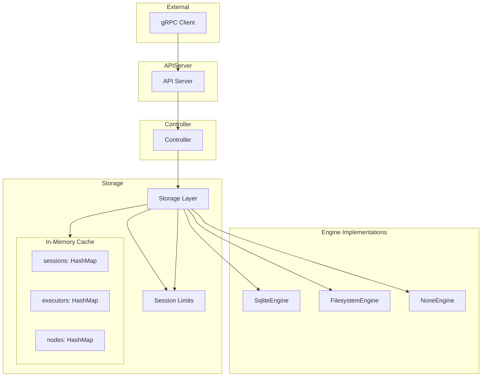
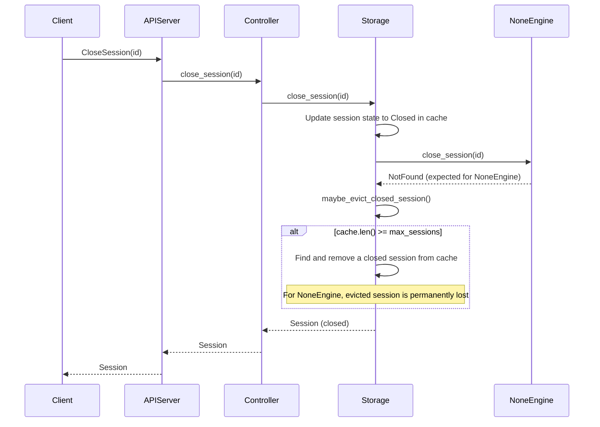
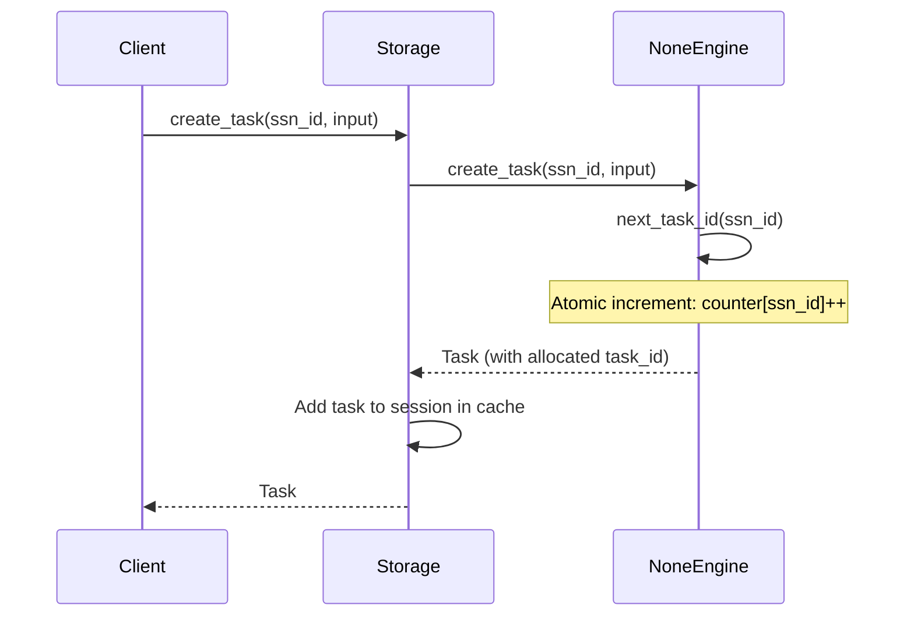

# Design Document: None Storage for Non-Recoverable Tasks

## 1. Motivation

**Background:**

Currently, Flame's Session Manager supports two storage backends via the `Engine` trait:
- **SQLite** (`sqlite://`) - Persistent relational storage (default)
- **Filesystem** (`fs://`) - Persistent file-based storage

Both backends persist data to disk, which provides durability but introduces I/O overhead. In some use cases, the output of tasks already indicates success/failure, and persisting all task state/input/output is unnecessary overhead. For these non-recoverable workloads, avoiding disk persistence provides better performance.

**Use Cases for Non-Recoverable Tasks:**
1. **Real-time Processing**: Task results are consumed immediately; historical state is not needed
2. **Stateless Workloads**: External systems track state; Flame is purely a task dispatcher
3. **High-Throughput Scenarios**: Disk I/O becomes the bottleneck
4. **Development and Testing**: Fast iteration without persistence overhead

Additionally, without persistence, sessions and tasks accumulate in memory. A session limit prevents unbounded memory growth by limiting the number of concurrent open sessions.

**Target:**

This design aims to:

1. **Introduce a "None" Storage Engine** - A new `Engine` implementation that stores all data purely in memory with no disk persistence
2. **Add Session Limit** - Limit the maximum number of open sessions to prevent resource exhaustion
3. **Maintain API Compatibility** - No API changes; transparent to clients

## 2. Function Specification

**Configuration:**

Add none storage engine and limits configuration in `flame-cluster.yaml`:

```yaml
cluster:
  name: "flame-dev"
  storage: "none"                # New: None storage engine (no persistence)
  # OR existing options:
  # storage: "sqlite:///var/lib/flame/sessions.db"
  # storage: "fs:///var/lib/flame"
  
  limits:                        # New section for resource limits
    sessions: 10000              # Maximum number of sessions (open + closed) in cache
```

**Environment Variables:**
- `FLAME_STORAGE`: Override storage URL (e.g., `none`)
- `FLAME_LIMITS_SESSIONS`: Override maximum open sessions

**API:**

No changes to external gRPC APIs. The none storage engine implements the existing `Engine` trait:

```rust
#[async_trait]
pub trait Engine: Send + Sync + 'static {
    // Session operations
    async fn create_session(&self, attr: SessionAttributes) -> Result<Session, FlameError>;
    async fn get_session(&self, id: SessionID) -> Result<Session, FlameError>;
    async fn open_session(&self, id: SessionID, spec: Option<SessionAttributes>) -> Result<Session, FlameError>;
    async fn close_session(&self, id: SessionID) -> Result<Session, FlameError>;
    async fn delete_session(&self, id: SessionID) -> Result<Session, FlameError>;
    async fn find_session(&self) -> Result<Vec<Session>, FlameError>;
    
    // Task, Node, Executor, Application operations...
}
```

**CLI:**

No changes to CLI. Storage engine is selected via `flame-cluster.yaml` configuration.

**Scope:**

*In Scope:*
- `NoneEngine` implementation of `Engine` trait (no persistence)
- Session limit: maximum number of open sessions
- Thread-safe concurrent access

*Out of Scope:*
- Distributed memory storage (single-node only)
- Limits for executors, nodes, or applications (sessions only)
- Persistence snapshots or recovery mechanisms
- TTL-based cleanup for closed sessions (may be added in future iterations)

*Limitations:*
- When session-manager restarts, sessions/tasks are lost (by design for non-recoverable tasks)

**Session Limit:**
- **`sessions`**: Maximum number of sessions (open + closed) kept in controller's in-memory cache.
- When limit is NOT exhausted: closed sessions remain in controller's cache for fast access
- When limit IS exhausted: oldest closed sessions are evicted from controller's cache
  - For **persistent engines** (SQLite/Filesystem): evicted sessions remain in storage engine and can be retrieved via `get_session`/`list_session`
  - For **NoneEngine**: evicted sessions are **permanently lost** (by design - no persistence)

**Feature Interaction:**

*Related Features:*
- **RFE366 LRU Policy for ObjectCache**: Similar pattern, different component. ObjectCache evicts cached objects; this evicts sessions.
- **RFE209 Filesystem Storage**: Provides the filesystem `Engine` implementation pattern we'll follow
- **RFE384 Flame Recovery**: Recovery mechanisms won't work with memory storage

*Updates Required:*
1. `session_manager/src/storage/engine/mod.rs`: Add `NoneEngine` and `connect()` dispatch
2. `session_manager/src/storage/mod.rs`: Add session limit check and cache eviction logic
3. `session_manager/src/storage/mod.rs`: Update `list_session` to merge cache + engine results
4. `common/src/ctx.rs`: Add `Limits` config struct

*Integration Points:*
- None engine integrates via existing `Engine` trait
- Session limit checked on `close_session()` to decide cache eviction
- `list_session` queries both cache and engine

*Compatibility:*
- Fully backward compatible: existing configs continue to use SQLite/Filesystem
- Default: no limits (current behavior)

*Breaking Changes:*
- None. None storage is opt-in via `storage: "none"` configuration.

## 3. Implementation Detail

**Architecture:**



**Components:**

### Component 1: NoneEngine (`session_manager/src/storage/engine/none.rs`)

A minimal `Engine` implementation for non-recoverable workloads. The NoneEngine only maintains task ID counters - all actual data lives in controller's cache:

```rust
pub struct NoneEngine {
    // Only maintain counters for ID allocation
    task_counters: MutexPtr<HashMap<SessionID, AtomicI64>>,  // Per-session task ID counter
}

impl NoneEngine {
    pub async fn new_ptr(_url: &str) -> Result<EnginePtr, FlameError> {
        Ok(Arc::new(Self {
            task_counters: stdng::new_ptr(HashMap::new()),
        }))
    }
    
    /// Allocate next task ID for a session
    fn next_task_id(&self, ssn_id: &SessionID) -> Result<TaskID, FlameError> {
        let mut counters = lock_ptr!(self.task_counters)?;
        let counter = counters
            .entry(ssn_id.clone())
            .or_insert_with(|| AtomicI64::new(0));
        Ok(counter.fetch_add(1, Ordering::SeqCst) + 1)
    }
}

#[async_trait]
impl Engine for NoneEngine {
    // Session operations - minimal implementation, controller cache is source of truth
    async fn create_session(&self, attr: SessionAttributes) -> Result<Session, FlameError> {
        // Initialize task counter for this session
        let mut counters = lock_ptr!(self.task_counters)?;
        counters.insert(attr.id.clone(), AtomicI64::new(0));
        
        // Return new session object (controller will cache it)
        Ok(Session::new(attr))
    }
    
    async fn get_session(&self, id: SessionID) -> Result<Session, FlameError> {
        // NoneEngine doesn't store sessions - controller cache is source of truth
        Err(FlameError::NotFound(format!("session <{}>", id)))
    }
    
    async fn find_session(&self) -> Result<Vec<Session>, FlameError> {
        // NoneEngine doesn't store sessions
        Ok(vec![])
    }
    
    async fn open_session(&self, id: SessionID, spec: Option<SessionAttributes>) -> Result<Session, FlameError> {
        // For NoneEngine, open_session creates a new session if not in cache
        // Controller checks cache first before calling this
        let attr = spec.unwrap_or_else(|| SessionAttributes { id: id.clone(), ..Default::default() });
        self.create_session(attr).await
    }
    
    async fn close_session(&self, id: SessionID) -> Result<Session, FlameError> {
        // NoneEngine doesn't store sessions - return error
        // Controller handles the actual close by updating its cache
        Err(FlameError::NotFound(format!("session <{}>", id)))
    }
    
    async fn delete_session(&self, id: SessionID) -> Result<Session, FlameError> {
        // Clean up task counter
        let mut counters = lock_ptr!(self.task_counters)?;
        counters.remove(&id);
        // Return error - session data was in controller cache, not engine
        Err(FlameError::NotFound(format!("session <{}>", id)))
    }
    
    // Task operations - allocate IDs only
    async fn create_task(&self, ssn_id: SessionID, input: Option<TaskInput>) -> Result<Task, FlameError> {
        let task_id = self.next_task_id(&ssn_id)?;
        Ok(Task::new(ssn_id, task_id, input))
    }
    
    // Other task/node/executor operations return NotFound or empty
    // Controller cache handles all data storage for NoneEngine
}
```

**Key NoneEngine Behaviors:**
- `create_session`: Initialize task counter, return new Session object
- `create_task`: Allocate task ID, return new Task object  
- `get_session/find_session`: Return NotFound/empty (data is in controller cache)
- `close_session/delete_session`: Return NotFound (controller handles state)
- All other operations: Return NotFound or empty (no persistence)

### Component 2: Storage Layer Changes (`session_manager/src/storage/mod.rs`)

Add session limit check and cache eviction logic into the Storage struct:

```rust
/// Configuration for limits
#[derive(Debug, Clone, Deserialize, Default)]
pub struct LimitsConfig {
    pub sessions: Option<usize>,      // Maximum sessions in controller cache
}

pub struct Storage {
    context: FlameClusterContext,
    engine: EnginePtr,
    sessions: MutexPtr<HashMap<SessionID, SessionPtr>>,  // Controller's in-memory cache
    executors: MutexPtr<HashMap<ExecutorID, ExecutorPtr>>,
    nodes: MutexPtr<HashMap<String, NodePtr>>,
    applications: MutexPtr<HashMap<String, ApplicationPtr>>,
    event_manager: EventManagerPtr,
    
    // New: Session limit for cache
    max_sessions: Option<usize>,
}

impl Storage {
    /// Check if cache is at limit and evict closed sessions if needed
    fn maybe_evict_closed_session(&self) -> Result<(), FlameError> {
        let Some(max) = self.max_sessions else {
            return Ok(());  // No limit configured, keep all sessions
        };
        
        let mut ssn_map = lock_ptr!(self.sessions)?;
        
        if ssn_map.len() < max {
            return Ok(());  // Under limit, no eviction needed
        }
        
        // Find closed sessions to evict
        let closed_session_id: Option<SessionID> = ssn_map.iter()
            .find_map(|(id, ssn_ptr)| {
                let ssn = lock_ptr!(ssn_ptr).ok()?;
                if ssn.status.state == SessionState::Closed {
                    Some(id.clone())
                } else {
                    None
                }
            });
        
        // Evict from cache
        // For persistent engines: session still exists in storage
        // For NoneEngine: session is permanently lost
        if let Some(ssn_id) = closed_session_id {
            ssn_map.remove(&ssn_id);
            tracing::debug!("Evicted closed session <{}> from cache", ssn_id);
        }
        
        Ok(())
    }
    
    /// Get session - check cache first, fallback to engine for persistent storage
    pub fn get_session(&self, id: SessionID) -> Result<Session, FlameError> {
        // Check cache first (this is the current behavior)
        let ssn_map = lock_ptr!(self.sessions)?;
        if let Some(ssn_ptr) = ssn_map.get(&id) {
            let ssn = lock_ptr!(ssn_ptr)?;
            return Ok(ssn.clone());
        }
        
        // Not in cache - for persistent engines, could query engine here
        // For NoneEngine, session is lost if evicted from cache
        Err(FlameError::NotFound(format!("session <{}>", id)))
    }
    
    /// List sessions from cache
    /// Note: For NoneEngine, cache is the only source of truth
    /// For persistent engines, could merge with engine.find_session() if needed
    pub fn list_session(&self) -> Result<Vec<Session>, FlameError> {
        let ssn_map = lock_ptr!(self.sessions)?;
        let ssn_list: Vec<Session> = ssn_map.values()
            .filter_map(|ssn_ptr| {
                let ssn = lock_ptr!(ssn_ptr).ok()?;
                Some(ssn.clone())
            })
            .collect();
        Ok(ssn_list)
    }
    
    /// Close session - update state and potentially evict from cache
    pub async fn close_session(&self, id: SessionID) -> Result<Session, FlameError> {
        // For NoneEngine, we handle close directly in cache
        // For persistent engines, delegate to engine first
        
        // Update in-memory cache
        let ssn_ptr = {
            let ssn_map = lock_ptr!(self.sessions)?;
            ssn_map.get(&id).cloned()
                .ok_or(FlameError::NotFound(format!("session <{}>", id)))?
        };
        
        {
            let mut ssn = lock_ptr!(ssn_ptr)?;
            ssn.status.state = SessionState::Closed;
            ssn.completion_time = Some(Utc::now());
            ssn.version += 1;
        }
        
        // Try to persist to engine (NoneEngine returns NotFound, which is ok)
        let _ = self.engine.close_session(id.clone()).await;
        
        // Check if we need to evict closed sessions due to limit
        self.maybe_evict_closed_session()?;
        
        let ssn = lock_ptr!(ssn_ptr)?;
        Ok(ssn.clone())
    }
}
```

**Data Structures:**

```rust
/// Configuration for limits
#[derive(Debug, Clone, Deserialize, Default)]
pub struct LimitsConfig {
    pub sessions: Option<usize>,      // Maximum open sessions
}
```

**Algorithms:**

*Cache Eviction on Close (when limit exhausted):*
```
1. If max_sessions not configured, keep all sessions in cache
2. If cache.len() < max_sessions, no eviction needed
3. Find any closed session in cache
4. Remove closed session from cache
   - For persistent engines: session remains in engine storage
   - For NoneEngine: session is permanently lost (by design)
```

*NoneEngine Behavior:*
```
- Does NOT store session/task/node/executor data
- Controller cache is the ONLY source of truth for NoneEngine
- ONLY maintains per-session task ID counters for allocation:
  - create_session(): Initialize task counter, return new Session object
  - create_task(): Allocate next task ID (sequential: 1, 2, 3...), return new Task object
  - get_session/find_session(): Return NotFound/empty (data is in controller cache only)
  - close_session/delete_session(): Return NotFound (controller handles state)
  - delete_session(): Also cleans up task counter
```

*Integration with Session Lifecycle:*
```
create_session():
  1. Call engine.create_session(attr) - returns Session object
     - NoneEngine: initializes task counter, returns new Session
     - Persistent engines: persist to storage, return Session
  2. Add returned Session to controller cache

close_session():
  1. Update session state to Closed in controller cache
  2. Call engine.close_session(id)
     - NoneEngine: returns NotFound (ignored)
     - Persistent engines: persist state change
  3. Call maybe_evict_closed_session() to enforce limit

delete_session():
  1. Call engine.delete_session(id)
     - NoneEngine: cleans up task counter, returns NotFound
     - Persistent engines: delete from storage
  2. Remove from controller cache

get_session(id):
  1. Check controller cache
  2. If found, return session
  3. If NOT found, return NotFound
     (Note: current implementation doesn't fallback to engine)

list_session():
  1. Return all sessions from controller cache
     (Note: current implementation doesn't query engine)
```

**Sequence Diagram - Session Close with Cache Eviction:**



**Sequence Diagram - Task Creation with ID Allocation:**



**System Considerations:**

*Performance:*
- NoneEngine: O(1) task ID allocation, no I/O latency
- Session limit check: O(n) scan for closed sessions (can be optimized with separate closed session tracking if needed)

*Scalability:*
- Memory storage scales with available RAM
- Session limit prevents unbounded cache growth
- No disk I/O bottleneck for NoneEngine

*Reliability:*
- Data is ephemeral by design - no recovery after restart
- Session limit protects against resource exhaustion
- **Important**: For NoneEngine, evicted closed sessions are permanently lost

*Thread Safety:*
- `MutexPtr` (from stdng) protects all data structures

*Resource Usage:*
- Memory: Bounded by session limit
- CPU: Minimal overhead for limit checking
- Disk: None for NoneEngine

*Security:*
- No change to security model
- Data in memory only - no disk artifacts

*Observability:*
- Expose metrics: `flame_sessions_total`, `flame_sessions_open`, `flame_sessions_evicted_total`

**Dependencies:**

*Internal Dependencies:*
- `stdng`: MutexPtr, lock_ptr macro
- `common`: FlameError, session types

## 4. Use Cases

**Example 1: Non-Recoverable Task Workload**

- Description: High-throughput task processing where results are consumed immediately
- Configuration:
  ```yaml
  cluster:
    storage: "none"
    limits:
      sessions: 1000        # Max 1000 sessions in cache
  ```
- Workflow:
  1. Start Flame with none storage
  2. Create sessions, run tasks at high throughput
  3. All data in RAM - no disk I/O overhead
  4. When sessions close and cache reaches 1000, oldest closed sessions are evicted
  5. Evicted sessions are permanently lost (by design for non-recoverable tasks)
  6. Restart clears all data (expected)
- Expected outcome: High performance, bounded memory, ephemeral sessions

**Example 2: Edge Deployment with Strict Limit**

- Description: Edge node processing ephemeral tasks with limited RAM
- Configuration:
  ```yaml
  cluster:
    storage: "none"
    limits:
      sessions: 100         # Max 100 sessions in cache
  ```
- Workflow:
  1. Edge node processes ephemeral sessions
  2. Session limit keeps memory bounded
  3. Closed sessions are evicted as new sessions are created
- Expected outcome: Stable memory footprint on constrained hardware

**Example 3: Backward Compatibility (No Limits)**

- Description: Existing deployment continues working unchanged
- Configuration:
  ```yaml
  cluster:
    storage: "sqlite:///var/lib/flame/db"
    # No limits section = no cache eviction
  ```
- Workflow:
  1. Upgrade to new version
  2. No limits config = no cache eviction (current behavior)
  3. All sessions remain in cache
- Expected outcome: Zero behavior change for existing deployments

**Example 4: Persistent Storage with Cache Limit**

- Description: SQLite persistence with limited in-memory cache
- Configuration:
  ```yaml
  cluster:
    storage: "sqlite:///var/lib/flame/db"
    limits:
      sessions: 5000        # Max 5000 sessions in cache
  ```
- Workflow:
  1. Sessions persist to SQLite
  2. In-memory cache limited to 5000 sessions
  3. When limit reached, closed sessions evicted from cache
  4. Evicted sessions still exist in SQLite - can be retrieved if needed
- Expected outcome: Bounded memory with persistent storage backup

## 5. References

**Related Documents:**
- RFE209 Filesystem Storage: `docs/designs/RFE209-filesystem-storage/`
- Design Template: `docs/designs/templates.md`

**External References:**
- GitHub Issue: https://github.com/xflops/flame/issues/394

**Implementation References:**
- Engine trait: `session_manager/src/storage/engine/mod.rs`
- Storage layer: `session_manager/src/storage/mod.rs`
- Controller: `session_manager/src/controller/mod.rs`
- Configuration: `common/src/ctx.rs`
